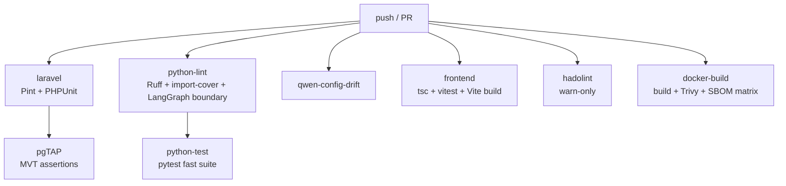
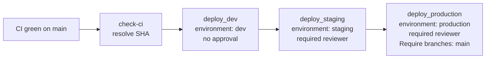

# CI/CD Pipeline Documentation — GeoRAG Intelligence V1.0

> Inferred from `.github/workflows/` and `docker/`. Three primary
> workflows drive CI; `cd.yml` drives deployment with a three-stage
> gate (dev → staging → production). Several auxiliary workflows
> handle chaos, perf baselines, release rehearsal, and tenant-isolation
> auditing.

---

## 1. Workflow inventory

| Workflow file                       | Trigger                                                          | Purpose                                                                |
| ----------------------------------- | ---------------------------------------------------------------- | ---------------------------------------------------------------------- |
| `ci.yml`                            | `push` to `main` / `develop`; PRs to `main`                      | Primary CI gate — lint, type-check, unit/feature tests, Docker build + scan + SBOM, pgTAP. |
| `cd.yml`                            | `workflow_run` on CI success + `workflow_dispatch`               | Three-stage SSH deploy (dev → staging → production).                  |
| `e2e.yml`                           | (per filename) End-to-end tests                                  | Playwright + integration suite.                                        |
| `chaos.yml`                         | Cron (weekly per CI exclusion note)                              | Chaos-marker pytest subset; FastAPI resilience under failure injection.|
| `perf-baseline.yml`                 | Cron / dispatch                                                  | API latency + capacity baseline measurement.                           |
| `release-rehearsal.yml`             | Tag push / dispatch                                              | Bucket 3 — full-stack live tests (`integration`, `golden`, `hallucination`, `live` markers). Stack-dependent gates the fast PR suite skips. |
| `tenant-isolation-auditor.yml`     | Cron / dispatch                                                  | RLS / workspace-isolation regression auditor.                          |

Note — `.github/dependabot.yml` is present (Dependabot configured).
`.github/scripts/` and `.github/workflows/` (nested) contain supporting
scripts. No `composer` or `npm` publish workflow was observed; the
project does not publish packages.

---

## 2. CI pipeline (`ci.yml`)

### 2.1 Triggers + concurrency

```yaml
on:
  push:    { branches: [main, develop] }
  pull_request: { branches: [main] }

concurrency:
  group: ci-${{ github.ref }}
  cancel-in-progress: true
```

### 2.2 Pinned tool versions

| Tool   | Version |
| ------ | ------- |
| PHP    | 8.4     |
| Node   | 22      |
| Python | 3.13    |

### 2.3 Job graph



### 2.4 Per-job detail

**`laravel`** (10 min timeout)

- Postgres service: `postgis/postgis:18-3.6@sha256:f81dd…` (digest pinned).
- Steps: `composer install`, `vendor/bin/pint --test`, `php artisan key:generate`,
  `php artisan migrate --force`, `php artisan test --parallel`.

**`python-lint`** (5 min)

- `ruff check src/fastapi/` and `src/dagster/`.
- `scripts/check_pyproject_covers_imports.py` for both FastAPI and Dagster
  (closes the doc-phase 122 hole where `sentry_sdk` was imported but
  not in `dependencies`).
- `scripts/ci/langgraph_boundary_check.sh` — Phase 0 #16 stack discipline:
  fails the build if LangGraph touches Hatchet-owned work (retries) or
  Kestra-owned work (outbound webhooks).

**`qwen-config-drift`** (2 min)

- `scripts/check_qwen_config_drift.py` verifies four Qwen settings stay
  consistent across `.env.example`, `docker-compose.yml`, and FastAPI
  `config.py`. Justified by a 2026-04-27 review that found three live
  drifts.

**`python-test`** (10 min, depends on python-lint)

- `uv sync --extra dev` for both `src/fastapi` and `src/dagster`.
- FastAPI: `uv run pytest -m "not integration and not golden and not hallucination and not live and not chaos"`.
- Dagster: `uv run pytest -m "not integration"`.
- The excluded markers are intentional: stack-dependent quality gates
  run in `release-rehearsal.yml`; chaos runs weekly via `chaos.yml`.

**`frontend`** (10 min)

- `npm ci`, `npx tsc --noEmit`, `npm run test --if-present`, `npm run build`.

**`pgtap`** (15 min, depends on `laravel`)

- Builds pgTAP 1.3.3 from source against PG 18.
- Loads `database/tests/pgtap/seed_golden_fixture.sql`, then runs every
  `NN_*.sql` file under `database/tests/pgtap/`.
- Reports per-file PASS / FAIL with assertion plan counts.

**`hadolint`** (5 min, warn-only)

- Lints `docker/fastapi.Dockerfile`, `docker/laravel.Dockerfile`,
  `docker/dagster.Dockerfile` with `failure-threshold: warning`
  (closes L-A4-09). Tighten to `error` once lint-clean.

**`docker-build`** (30 min, matrix)

- Matrix over `{ fastapi, laravel, dagster }`. `fail-fast: false`.
- Platforms: `linux/amd64,linux/arm64`.
- PRs: build + load only (no push). main: build + push to GHCR with
  two tags — `:<short-sha>` (immutable, consumed by `cd.yml`) and
  `:main` (rolling latest).
- Cache: GitHub Actions cache scoped per image name.
- Permissions: `contents: read`, `packages: write`, `id-token: write`.
- **Trivy**: severity `CRITICAL` fails the build (`exit-code: "1"`);
  HIGH is reported but not blocking; `ignore-unfixed: true`.
- **SBOM**: `anchore/sbom-action` produces SPDX-JSON; artifact retained
  90 days (closes L-A4-08).
- Note: vLLM is x86_64-only — arm64 hosts can run dev (Ollama) but not
  the prod LLM tier directly.

---

## 3. CD pipeline (`cd.yml`)

### 3.1 Trigger

- Automatic: `workflow_run` on `GeoRAG CI` success on `main`.
- Manual: `workflow_dispatch` with `target ∈ {dev, staging, production}`
  and optional `sha`.

### 3.2 Topology



### 3.3 Per-stage steps (uniform across dev / staging / production)

1. `actions/checkout@v4`.
2. **Install SOPS 3.9.4** from GitHub Releases (.deb).
3. **Decrypt** `.env.production.enc` → `.env.production` using
   `SOPS_AGE_PRIVATE_KEY` (age private key, per-environment secret).
4. **SSH deploy** to `<TARGET>_SSH_HOST` as `<TARGET>_SSH_USER` with
   `<TARGET>_SSH_KEY`:
   - `scp` the decrypted `.env.production` to `/opt/georag/.env.production`.
   - `ssh` and run `docker compose --env-file .env.production pull` for
     the four app services (`fastapi`, `laravel-octane`, `laravel-horizon`,
     `laravel-reverb`), then `docker compose ... --profile dev-light up -d --pull always`.
5. **Cleanup** — delete the runner-local plaintext env file in `if: always()` step.
6. **Health check** — poll `${BASE_URL}:8000/health` (FastAPI) and
   `${BASE_URL}/up` (Laravel) for up to 5 min (60 attempts × 5 s).

### 3.4 Environment + secret requirements

Per the comment block at the top of `cd.yml`:

**GitHub Environments**

- `dev` — no approval required.
- `staging` — required reviewer.
- `production` — required reviewer + "Require branches: main".

**Per-environment GitHub Secrets**

| Name                          | Purpose                                          |
| ----------------------------- | ------------------------------------------------ |
| `SOPS_AGE_PRIVATE_KEY`        | age private key to decrypt `.env.production.enc` |
| `{DEV,STAGING,PRODUCTION}_SSH_HOST`  | Target hostname / IP                       |
| `{DEV,STAGING,PRODUCTION}_SSH_USER`  | SSH username                               |
| `{DEV,STAGING,PRODUCTION}_SSH_KEY`   | SSH private key (ED25519 recommended)      |
| `DEV_BASE_URL`                | Optional override for health-check base URL      |

### 3.5 `continue-on-error` debt

Several steps carry `continue-on-error: true` flagged with TODO
comments — they are in place to keep the workflow runnable before
secrets are provisioned. Tracked:

- "Decrypt environment secrets" (until `SOPS_AGE_PRIVATE_KEY` is set).
- "Deploy to {dev,staging,production} host via SSH" (until SSH
  secrets are set).
- "Health check — dev" (until SSH host is configured).

Remove `continue-on-error: true` once GitHub Secrets are provisioned
(see `ops/runbooks/secret-management.md`).

### 3.6 Production deploy primitive

On-prem / private cloud — SSH + `docker compose` is the correct
primitive (not Kubernetes). Each environment is a single host running
the compose stack. K3s reference docs in `docs/deployment/` exist but
are not the primary path.

---

## 4. Image registry + image lifecycle

- **Registry**: `ghcr.io/${{ github.repository_owner }}/georag-{fastapi,laravel,dagster}`.
- **Tags**:
  - `:<short-sha>` — immutable, what `cd.yml` resolves and pulls.
  - `:main` — rolling latest on main.
- **Scan + SBOM** — every build is Trivy-scanned (CRITICAL blocks) and
  SBOM-attested (SPDX-JSON, retained 90 days).
- **Multi-arch** — linux/amd64 + linux/arm64.

The compose file's own image tags (`georag/<service>:latest`) refer to
**locally built** images for dev; the CI registry tags are for
deployments. To adopt SHA-based dev tagging, follow the recipe in the
compose file header (`docker compose build && docker images --format`).

---

## 5. Quality gates summary

| Gate                                | Where                          | Blocking? |
| ----------------------------------- | ------------------------------ | --------- |
| Laravel Pint                        | `ci.yml::laravel`              | Yes       |
| PHPUnit (parallel)                  | `ci.yml::laravel`              | Yes       |
| Ruff lint (FastAPI + Dagster)       | `ci.yml::python-lint`          | Yes       |
| Pyproject imports cover (FastAPI + Dagster) | `ci.yml::python-lint`  | Yes       |
| LangGraph boundary check            | `ci.yml::python-lint`          | Yes       |
| Qwen config drift                   | `ci.yml::qwen-config-drift`    | Yes       |
| FastAPI pytest (fast suite)         | `ci.yml::python-test`          | Yes       |
| Dagster pytest (non-integration)    | `ci.yml::python-test`          | Yes       |
| TypeScript `tsc --noEmit`           | `ci.yml::frontend`             | Yes       |
| Vitest (if present)                 | `ci.yml::frontend`             | Yes       |
| Vite build                          | `ci.yml::frontend`             | Yes       |
| pgTAP MVT assertions                | `ci.yml::pgtap`                | Yes       |
| Hadolint                            | `ci.yml::hadolint`             | Warn-only |
| Docker build + Trivy CRITICAL       | `ci.yml::docker-build`         | Yes (CRITICAL only) |
| SBOM generation                     | `ci.yml::docker-build`         | Soft (artifact) |
| Integration / golden / hallucination / live | `release-rehearsal.yml`| Tag-push only |
| Chaos                               | `chaos.yml`                    | Weekly cron |
| Tenant isolation auditor            | `tenant-isolation-auditor.yml` | Cron / dispatch |
| Perf baseline                       | `perf-baseline.yml`            | Cron / dispatch |
| E2E (Playwright)                    | `e2e.yml`                      | Per file (not inspected) |

---

## 6. Secrets management

- **Production env** — `.env.production.enc` (SOPS + age). Plaintext
  template lives at `.env.production.example` (CHANGE_ME placeholders).
- **Decryption key** — `SOPS_AGE_PRIVATE_KEY` stored as a GitHub
  Environment secret on each environment.
- **Bootstrap procedure** — `docs/OPERATOR-AFTERNOON.md` plus
  `scripts/operator/preflight.sh` walks the O-01..O-07 gates.
- **Rotation** — `docs/RUNBOOK.md` (PII decryption, APP_KEY rotation,
  shared-secret rotation procedures).

---

## 7. Local-only / dev workflow

Not CI/CD per se, but referenced by contributors:

- `composer run dev` — concurrent `php artisan serve`, queue listener,
  `php artisan pail`, and `npm run dev`.
- `composer run test`, `composer run lint`, `composer run stan`,
  `composer run pgtap`.
- `npm run build`, `npm run test`, `npm run typecheck`.
- `php artisan octane:reload` — required after every `vite build`
  because Octane caches the Vite manifest in memory
  (`feedback_octane_vite_reload`).

---

## 8. Missing / Needs Confirmation

- **`e2e.yml` internals** — not inspected. Confirm whether it runs
  Playwright against the dev compose stack and which suite triggers it.
- **`release-rehearsal.yml`** — referenced from `ci.yml`'s comment
  block as the Bucket 3 stack-dependent gate, but the full job graph
  was not enumerated here.
- **Migration safety in CD** — `cd.yml` calls `docker compose pull` +
  `up -d`. No explicit `artisan migrate` step appears. Migrations
  presumably run from a deploy hook on the host or via `composer install`
  on the target — confirm where prod migrations execute.
- **Cron schedules** — exact cron expressions for `chaos.yml`,
  `perf-baseline.yml`, and `tenant-isolation-auditor.yml` were not
  enumerated in this pass.
- **`continue-on-error` cleanup** — multiple steps in `cd.yml` carry
  TODO markers. Track completion in `ops/runbooks/secret-management.md`.
- **Image signing** — Trivy + SBOM are wired, but no cosign signing
  step appears in `ci.yml`. Confirm whether image signing is planned.
- **Container registry retention** — GHCR retention policy not
  inspected.
