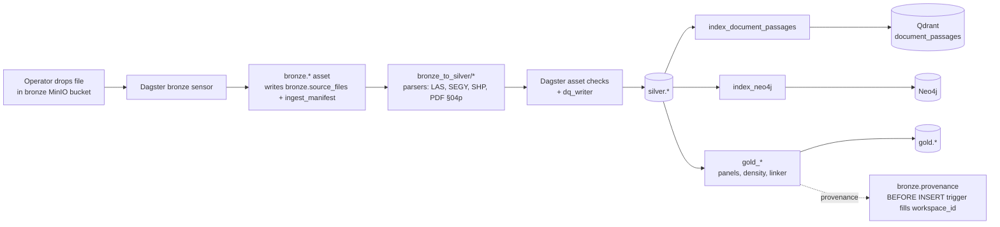
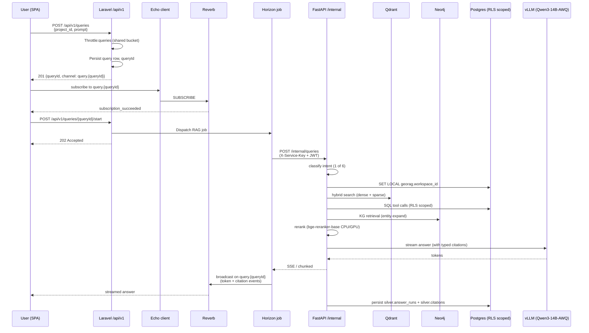
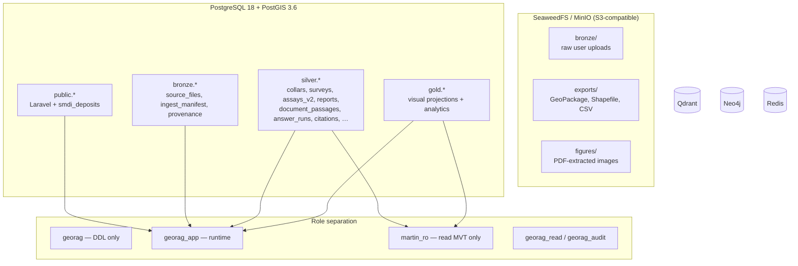

# Data Flow Specification (DFS) — GeoRAG Intelligence V1.0

> Inferred from `routes/*`, `app/Http/Controllers/*`,
> `src/fastapi/app/routers/*`, `src/dagster/georag_dagster/assets/*`,
> and `docker-compose.yml`. Where the implementation is opinionated, the
> opinions are captured verbatim. Where the architecture spec is the only
> source, that is marked as **Assumption**.

---

## 1. Primary data domains

| Domain                 | System of record                    | Tenancy             |
| ---------------------- | ----------------------------------- | ------------------- |
| Users / sessions       | `public.users` + Sanctum tokens     | global              |
| Projects + memberships | `public.projects`, `project_user`   | per workspace       |
| Drill data             | `silver.collars`, `silver.surveys`, `silver.lithology_logs`, `silver.alterations`, `silver.structures`, `silver.assays_v2` | per workspace via RLS |
| Reports                | `silver.reports`, `silver.document_passages` | per workspace via RLS |
| Public-geoscience      | `silver.public_geoscience_*`, `public.smdi_deposits` | global (publish/read-only) |
| Chat / answers         | `public.chat_conversations`, `silver.answer_runs`, `silver.citations` | per workspace + per user |
| Ingestion provenance   | `bronze.source_files`, `bronze.ingest_manifest`, `bronze.provenance`, `silver.ingest_progress`, `silver.review_queue` | per workspace |
| Audit                  | `silver.audit_findings`, `silver.refusals`, `silver.citation_feedback` | per workspace |
| Vector embeddings      | Qdrant `document_passages` (canonical), `public_geoscience` (legacy) | payload-tagged by workspace |
| Knowledge graph        | Neo4j — DrillHole / Lithology / Alteration / Sample / Structure / Report nodes | label / property-tagged by workspace |

---

## 2. End-to-end data flows

### 2.1 Document ingestion (bulk — Dagster path)



Key behaviours:

- The bronze layer is a thin landing zone — files go to MinIO/SeaweedFS,
  rows go to `bronze.source_files` + `bronze.ingest_manifest`.
- Silver is the validated typed domain — `silver.reports`,
  `silver.collars`, `silver.surveys`, `silver.assays_v2`,
  `silver.geophysics_surveys`, etc. RLS is enforced here.
- A BEFORE INSERT trigger on `bronze.provenance` auto-fills
  `workspace_id` by joining the target silver row, so no writer is
  responsible for setting it
  (`project_bronze_provenance_autofill_2026_05_25`).
- Gold tables (`gold.drillhole_intervals_visual`,
  `gold.structure_measurements_visual`, `gold.h3_density`,
  `gold.cross_section_panels`, `gold.cross_corpus_linker`) are
  analytics-ready projections.
- Index assets (`index_document_passages`, `index_neo4j`,
  `index_public_geoscience`, `index_reports`) write to Qdrant + Neo4j.

### 2.2 User upload (Laravel → Hatchet path)

```mermaid
flowchart LR
    User[User: POST /api/v1/projects/{slug}/drill-uploads<br/>multipart upload] --> Ctrl[DrillUploadController]
    Ctrl -- "validate + slug-route" --> S3[Bronze bucket<br/>SeaweedFS / MinIO]
    Ctrl --> Source[bronze.source_files row]
    Ctrl -- "Dagster GraphQL trigger" --> Dagster
    Dagster --> Hatchet[hatchet-worker-ingestion<br/>durable workflow w/ retries]
    Hatchet --> Parse[PDF §04p: PyMuPDF primary,<br/>pdfplumber tables, docling GPU opt-in,<br/>OCR fallback]
    Parse --> Embed[hatchet-worker-ai<br/>bge-small + SPLADE++]
    Embed --> Qdrant[(Qdrant)]
    Parse --> KG[Neo4j writes]
    Parse --> Silver[(silver.reports +<br/>silver.document_passages)]
    Hatchet --> Progress[silver.ingest_progress upsert]
    Progress -. POST /internal/v1/ingest-progress/broadcast .-> Laravel[Laravel /internal bridge]
    Laravel --> Reverb[Reverb broadcast<br/>project.{projectId}.ingestion]
    Reverb --> Browser[useWorkspaceDataUpdated<br/>+ ingestion-runs page]
```

Key behaviours:

- Drill uploads are slug-routed and create `bronze.source_files` rows
  synchronously, then dispatch to Dagster.
- The Hatchet ingest workflow heartbeats; stale runs are swept every
  10 minutes (`stale_run_sweep` task → `embed_verify` dispatch).
- Real-time progress is pushed from FastAPI back to Laravel via the
  `service.key`-protected `/internal/v1/ingest-progress/broadcast`
  bridge, which fans out over the `project.{projectId}.ingestion`
  Reverb channel.
- Polling fallback: `GET /api/v1/ingest-progress/{run_id}` returns
  404 on cross-workspace `run_id`s to prevent existence fingerprinting
  (Reliability Spec Phase 4).

### 2.3 RAG query — two-phase handshake



Key behaviours:

- The two-phase store/start is required because the client must be
  on the Reverb channel before the worker starts broadcasting.
- The shared `queries` rate limiter counts both phases together.
- Workspace tenancy: `AgentDeps.acquire_scoped` opens a transaction
  and sets `SET LOCAL georag.workspace_id` + `statement_timeout = '10s'`
  so RLS policies fire and runaway queries die.
- Citations are mandatory — outputs missing `source_chunk_id` are
  rejected by the Pydantic AI output validator. The refusal path
  writes to `silver.refusals` and pushes a `query.refused` event.
- Trust summary: `GET /api/v1/answer-runs/{id}/trust-summary` proxies
  to FastAPI for the 7-section trust payload powering the per-answer
  drawer.

### 2.4 Map / visualization data flow

```mermaid
flowchart LR
    UI[MapLibre GL on /explorer] -- "vector tile request" --> Martin
    Martin --> SilverMVT[silver MVT functions<br/>granted to martin_ro]
    UI -- "GET /api/v1/projects/{id}/coverage-density" --> Laravel
    Laravel --> CoverageRouter[FastAPI coverage router]
    CoverageRouter --> Postgres
    CoverageRouter -->|GeoJSON heatmap| UI
    UI -- "POST /api/v1/charts/render" --> Charts[ChartsGalleryController]
    Charts --> FastAPIViz[/internal/visualizations]
    FastAPIViz --> Postgres
    FastAPIViz -->|Plotly JSON| UI
```

### 2.5 Real-time fan-out summary

| Channel                                     | Producer                                                              | Consumer                                            |
| ------------------------------------------- | --------------------------------------------------------------------- | --------------------------------------------------- |
| `query.{queryId}`                           | Horizon RAG job (forwarded from FastAPI SSE)                          | Chat page — token-by-token render + final citations |
| `project.{projectId}.ingestion`             | `/internal/v1/ingest-progress/broadcast` (FastAPI ↔ Laravel bridge)   | `Foundry/IngestionRuns`, `useWorkspaceDataUpdated` hook |
| `workspace.{workspaceId}.activity`          | `/internal/v1/workspace-activity` (Phase 3 bridge)                    | Foundry/Portfolio + Foundry/Projects                |
| `App.Models.User.{id}`                      | `/internal/v1/user-inbox-updated` (Phase 3 bridge)                    | Inbox + nav-bar badge                               |
| `admin.workflow-runs` / `admin.cluster-ingest` / `admin.target-recommendation` / `admin.reports` / `admin.reports.{build_id}` / `admin.ml-training` / `admin.audit-findings` / `admin.alerts-inbox` / `admin.ingestion-review` | `/internal/v1/admin-surface-updated` bridge | Admin Tier 1–4 surfaces |
| `public_geoscience_tiles_invalidated` (event) | `/internal/v1/public-geoscience-tiles-invalidated`                  | MapLibre setTiles cache-bust                        |

---

## 3. Data classification

- **PII** — User email/name (Laravel `users` table). PII handling
  procedures live in `docs/RUNBOOK.md`.
- **Confidential exploration data** — drill assays, lithology,
  coordinates. RLS-scoped by `workspace_id`. **Assumption**: industry
  norm is that these are commercial-confidential to the workspace owner.
- **Public-geoscience** — SMDI, MINFILE, MRDS rows are public-domain
  source data. The `silver.public_geoscience_*` and
  `public.smdi_deposits` tables are global.
- **LLM prompts / answers** — stored in `silver.answer_runs` with full
  prompt + chosen tool calls + citations. Tenant-scoped.
- **Service keys / JWTs** — `FASTAPI_SERVICE_KEY` is a shared secret.
  Production secret stored in `.env.production.enc` (SOPS + age).

---

## 4. Persistence contract highlights

- **Citations** (`silver.citations`) — every row links to a
  `source_chunk_id` referencing a row in `silver.document_passages`
  (or legacy chunks). The agent's typed output cannot reach persistence
  if citations are missing.
- **Answer runs** (`silver.answer_runs`) — query_class is a CHECK
  constraint matching the six-intent classifier; the smoke test on
  2026-05-20 caught a violation and added a `persist_node` to the
  agentic graph.
- **Provenance auto-fill** — bronze.provenance.workspace_id is filled
  by trigger; never set by writers. This closes a recurring
  "forgot ENABLE ROW LEVEL SECURITY" pattern.
- **Reranker labels** — `reranker_labels_helpers` writes synthetic
  judgements to feed the in-flight bge-reranker-base LoRA fine-tune.

---

## 5. Storage topology



---

## 6. Cache / pub-sub topology

- **Redis databases / prefixes** — Laravel cache, Horizon queues,
  Octane KV, broadcasting pub/sub. Specific db numbers are set in
  `config/database.php` and `.env` (`REDIS_*` vars). **Assumption**:
  one Redis instance, multiple logical dbs.
- **Reverb** — Reverb uses Redis as the backing presence/broker;
  Echo client speaks the pusher-js protocol against
  `ws(s)://<host>:8085`. `REVERB_HOST_PORT` historically had a
  variable-expansion trap (`project_reverb_dual_purpose_env_2026_05_21`).

---

## 7. Outbound integrations

- **Anthropic** — direct HTTPS (`anthropic.AsyncAnthropic`) when
  `LLM_BACKEND=anthropic`; pooled connection on `app.state`.
- **Kestra** — outbound webhooks per the §1 stack discipline.
  LangGraph code is CI-checked to NOT issue webhooks
  (boundary check in `scripts/ci/langgraph_boundary_check.sh`).
- **Public-geoscience source endpoints** — fetched by the Dagster
  `bronze_public_geoscience.py` asset on a schedule. **Needs Confirmation**:
  source URLs / rate limits.

---

## 8. Missing / Needs Confirmation

- **Email outbound** — no SMTP wiring observed in code; the system
  appears to be in-app-only for notifications. Confirm whether
  Notifications drivers (queueable + mail) are intended to be added.
- **Backup target** — `backup-agent` container is present and
  `compose.wal-archiving.yml` overlay enables WAL streaming. Storage
  target (S3 bucket, NFS, local) is configured via env vars that were
  not enumerated in this pass.
- **Qdrant snapshots** — collection snapshots cadence / target not
  inspected.
- **Dagster persistence** — `dagster.yaml` defines storage; not
  inspected for whether it points to Postgres or local SQLite.
