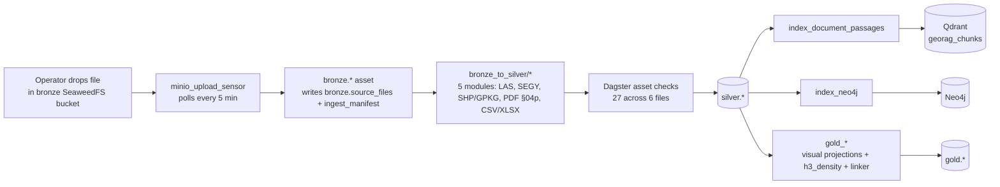
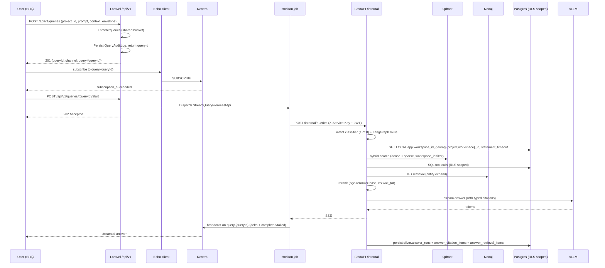
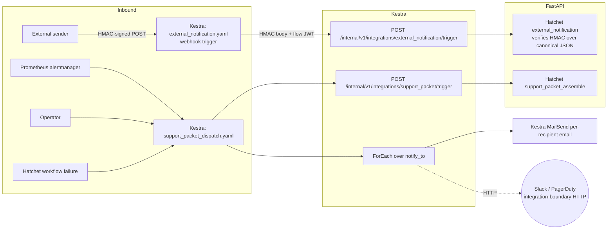

# Data Flow Specification — GeoRAG Intelligence

> Navigation overlay over the data plane. Routes into
> `georag-architecture.html` §04 (data model + schemas), `docs/architecture/*_spec.md`
> + `*_design.md` design notes, and the live migration files
> (`database/migrations/`, `database/raw/`, `docker/postgresql/init/`).
> **Never restates schema column-level detail that the migration files
> already own.** When the handover gives a count or a name, the migration
> or init script is the authoritative source.
>
> Caller-facing surfaces (HTTP routes, channels, contracts) live in
> [`API_DOCUMENTATION.md`](API_DOCUMENTATION.md).
> Component composition lives in [`SAD.md`](SAD.md).

---

## 1. Primary data domains

| Domain | System of record | Tenancy |
|---|---|---|
| Users / sessions | `public.users` + Sanctum tokens | global |
| Workspaces + memberships | `workspace.workspaces`, `workspace.memberships`, `workspace.roles` | global |
| Projects + project_user pivot | `silver.projects`, `public.project_user` | per workspace |
| Drill data | `silver.collars`, `silver.surveys`, `silver.lithology`, `silver.alteration`, `silver.structure`, `silver.assays_v2`, `silver.samples`, `silver.geochemistry`, `silver.geotechnical`, `silver.recovery`, `silver.mineralization`, `silver.well_log_curves`, `silver.specific_gravity` | RLS per workspace |
| Reports | `silver.reports`, `silver.report_pages`, `silver.report_figures`, `silver.report_tables`, `silver.document_passages`, `silver.document_versions` | RLS per workspace |
| Spatial features | `silver.spatial_features`, `silver.project_boundaries`, `silver.geological_formations`, `silver.historic_workings`, `silver.drill_traces`, `silver.cross_section_lines`, `silver.seismic_surveys`, `silver.raster_layers`, `silver.cog_rasters` | RLS per workspace |
| Public geoscience | `public_geo.*` (21 tables — SMDI, MINFILE, MRDS feature stores), `public.smdi_deposits` standalone | global / publish-read |
| Chat / answers | `public.chat_conversations`, `silver.answer_runs`, `silver.answer_retrieval_items`, `silver.answer_citation_items`, `silver.answer_citation_spans`, `silver.message_feedback`, `silver.refusals` | per workspace + per user |
| Ingestion provenance | `bronze.source_files`, `bronze.ingest_manifest`, `bronze.ingest_runs`, `bronze.provenance`, `bronze.raw_*` raw-row tables, `silver.review_queue`, `silver.ingest_progress`, `silver.parser_run_artifacts` | per workspace |
| Audit + claim ledger | `audit.audit_ledger`, `audit.audit_ledger_verification_runs`, `audit.audit_ledger_chain_fork_quarantine`, `audit.integration_credentials_audit`, `silver.claim_ledger`, `silver.query_traces`, `silver.alias_gaps`, `silver.data_quality_flags`, `silver.entity_aliases`, `silver.entity_gaps` | per workspace |
| Vector embeddings | Qdrant `georag_chunks` (canonical) + `georag_reports` (legacy) + 7 `pg_*` public-geo collections | payload-filtered by `workspace_id` |
| Knowledge graph | Neo4j — `:Project`, `:DrillHole`, `:Formation`, `:GeophysicalSurvey`, `:MineralOccurrence`, `:Publication`, `:Report` + 3 public-geo labels | label / property-tagged by workspace |
| Targeting | `targeting.target_recommendations`, `targeting.target_scores`, `targeting.target_score_factors`, `targeting.target_model_versions`, `targeting.target_outcomes`, `targeting.target_backtests`, `targeting.target_review_decisions`, etc. (10 tables) | RLS per workspace |
| Decisions + interpretation | `silver.decision_records`, `silver.decision_options`, `silver.decision_evidence_links`, `silver.decision_outcomes`, `silver.decision_lessons_learned`, `silver.hypotheses`, `silver.hypothesis_evidence_links`, plus `interpretation.interpretation_{notes,section_lines,target_zones,comments}` | per workspace |
| Outbox + workflow | `outbox.pending_propagations`, `outbox.propagation_attempts`, `workflow.workflow_runs`, `workflow.workflow_run_events`, `workflow.workflow_run_steps`, `workflow.flow_jwt_keys`, `workflow.flow_registry` | per workspace |
| Usage + cost | `usage.usage_events`, `usage.usage_aggregates_daily`, `usage.workspace_cost_ceilings`, `usage.idempotency_keys` | per workspace |
| Workspace settings | `workspace.agent_timeouts`, `workspace.prompt_versions`, `workspace.idempotency_keys`, `workspace.feature_flags`, `workspace.qp_credentials`, `workspace.workspace_settings`, etc. (14 tables) | per workspace |
| Eval | `eval.golden_questions`, `eval.run_results`, `eval.run_summaries` | global / per evaluation run |
| Backups + ops | `backups.snapshot_runs`, `ops.support_tickets`, `ops.support_ticket_traces`, `ops.support_replay_runs` | global |

Complete table inventory: `HANDOVER_MANIFEST.md` §7a (174 tables across 15 schemas).
Per-table data dictionary: live migration files at `database/migrations/`.

---

## 2. End-to-end data flows

### 2.1 Document ingestion (bulk Dagster path)



- **56** Dagster top-level asset modules + **5** in `bronze_to_silver/` + **7** in `silver_to_gold/` (verified 2026-05-29; the `silver_to_gold/` subdir owns: `assay_composites`, `campaign_summaries`, `drill_summaries`, `element_correlations`, `qaqc_statistics`, `significant_intersections`, `zone_statistics` — these are the Dagster assets that materialise the `gold.*` projection tables catalogued in §4.2c).
- Bronze.provenance.workspace_id auto-filled by BEFORE INSERT trigger from target silver row.
- 27 `@asset_check` quality gates across 6 files. Gates feed `WorkspaceDataUpdatedEmissionSlow` + `EmbedPendingPassagesStuck` alert families.
- Schedules + sensor + check inventory in [`CICD_PIPELINE.md`](CICD_PIPELINE.md) §6.5–§6.8.

### 2.2 User upload (Laravel → Hatchet path)

```mermaid
flowchart LR
    User[POST /api/v1/projects/{slug}/drill-uploads] --> Ctrl[DrillUploadController]
    Ctrl -- "validate + slug-route" --> S3[Bronze bucket]
    Ctrl --> Source[bronze.source_files row]
    Ctrl -- "Dagster GraphQL trigger" --> Dagster
    Dagster --> Hatchet[hatchet-worker-ingestion]
    Hatchet --> Parse[ingest_pdf workflow<br/>preflight → parse → persist]
    Parse --> Embed[hatchet-worker-ai<br/>bge-small + SPLADE++]
    Embed --> Qdrant[(Qdrant)]
    Parse --> KG[Neo4j writes]
    Parse --> Silver[(silver.reports + document_passages)]
    Hatchet --> Progress[silver.ingest_progress upsert]
    Progress -. POST /internal/v1/ingest-progress/broadcast .-> Laravel
    Laravel --> Reverb[Reverb broadcast<br/>project.{projectId}.ingestion]
```

- Drill uploads route through `App\Http\Controllers\Api\V1\DrillUploadController` (slug-routed, distinct from generic `/upload`).
- Hatchet ingest workflow heartbeats; stale runs swept every 15 min via `stale_run_detector` workflow.
- Real-time progress pushed via the `/internal/v1/ingest-progress/broadcast` bridge → Reverb fan-out.
- Polling fallback: `GET /api/v1/ingest-progress/{run_id}` ([`API_DOCUMENTATION.md`](API_DOCUMENTATION.md) §3.5).
- Workflow input/output Pydantic schemas: `src/fastapi/app/hatchet_workflows/ingest_pdf.py::{IngestPdfInput, PreflightOut, ParseOut, IngestPdfFinalOut}`.

### 2.3 RAG query (two-phase handshake + SSE)



- Two-phase store/start required so the client is on the Reverb channel before the worker broadcasts.
- Shared `queries` rate-limit bucket counts both phases (30/min per user).
- SSE event vocabulary: `delta` (token chunk), `completed` (terminal success), `failed` (terminal error). PascalCase event class names — see [`API_DOCUMENTATION.md`](API_DOCUMENTATION.md) §6.
- Repair-loop staging via `STRATEGY_FOR_CODE` dispatcher (18 GuardErrorCodes × 13 RepairStrategies); details in `docs/architecture/repair_loop_spec.md`.
- Hallucination prevention: 6 layers in `src/fastapi/app/agent/hallucination/`; SAD §4.1.

#### 2.3.1 Hybrid retrieval scoring (Reciprocal Rank Fusion)

Cross-store ranking is implemented in `src/fastapi/app/services/fusion.py` using standard Reciprocal Rank Fusion (RRF) per Cormack et al. 2009.

**Formula:** `score(d) = Σ over input lists of  1 / (k + rank_in_list(d))`
**Constant:** `RRF_K = 60` (the literature standard; smoothing constant — large `k` flattens the contribution of head positions).
**Input lists:** dense (bge-small-en-v1.5 on Qdrant `georag_chunks`), sparse (SPLADE++ on Qdrant), graph (Neo4j entity-expansion candidates), and (when present) structured-PG hits. Lists are ranked independently then fused.
**Per-list weighting:** controlled by `RetrievalProfile.bm25_weight` (`0.0` = dense-only … `1.0` = sparse-only) — per intent. The weight scales each list's RRF contribution; not a separate score modality.
**Tie-break:** when two candidates have identical RRF scores, they are ordered by `(source_priority, original_dense_score)` for diagnostic stability — see `fusion.py` docstring lines 1–50.
**Output:** RRF-ranked list passed to the reranker (`BAAI/bge-reranker-base`), which re-orders the top `RERANKER_TOP_K_BY_CLASS[query_class]` candidates by cross-encoder logit. If the reranker times out (>2s per batch), the RRF order is preserved as fallback (no hard failure — Spec B6).

Per-intent retrieval-profile contract (`src/fastapi/app/agent/agentic_retrieval/retrieval_profile.py`): 8 fields per intent — `primary_tools`, `secondary_tools`, `bm25_weight`, `conflict_detection_enabled`, `adversarial_pass_enabled`, `surface_qa_qc_fields`, `require_regulatory_constraints`, `answer_emphasis` (6-value Literal), `max_chunks`. The 8 intents × 8 fields matrix is the canonical retrieval contract — see SAD §3.3.2.

### 2.4 Map / visualization flow

```mermaid
flowchart LR
    UI[MapLibre GL on /explorer] -- "vector tile request" --> Martin[Martin tile server]
    Martin --> SilverMVT[silver MVT functions<br/>granted to martin_ro role]
    UI -- "GET /api/v1/projects/{id}/coverage-density" --> Laravel
    Laravel --> CoverageRouter[FastAPI /coverage]
    CoverageRouter --> Postgres
    CoverageRouter -->|GeoJSON heatmap| UI
    UI -- "POST /api/v1/charts/render" --> Charts[ChartsGalleryController]
    Charts --> FastAPIViz[/v1/viz/chart]
    FastAPIViz --> Postgres
    FastAPIViz -->|Plotly JSON| UI
```

- 8 chart kinds in `ChartsGalleryController::KNOWN_CHARTS` — see [`API_DOCUMENTATION.md`](API_DOCUMENTATION.md) §8.4.
- Tile cache-bust via `public_geoscience.tiles_invalidated` Reverb event.

### 2.5 Real-time fan-out

Channels + event classes + producer/consumer map in [`API_DOCUMENTATION.md`](API_DOCUMENTATION.md) §6. Data-flow side here:

| Channel | Producer (data source) | Consumer (Inertia hook) |
|---|---|---|
| `query.{queryId}` | Horizon RAG job (forwarding FastAPI SSE) | Foundry/Chat |
| `project.{projectId}.ingestion` | `/internal/v1/ingest-progress/broadcast` bridge | `useWorkspaceDataUpdated` |
| `workspace.{workspaceId}.activity` | `/internal/v1/workspace-activity` bridge | `useWorkspaceActivity` |
| `App.Models.User.{id}` | `/internal/v1/user-inbox-updated` | `useUserInbox` |
| Admin/* | `/internal/v1/admin-surface-updated` | `useAdminSurfaceUpdated` |
| `public-geoscience.tiles` | `/internal/v1/public-geoscience-tiles-invalidated` | `useTileInvalidation` |

### 2.6 Audit / PII flow

- **PII**: User PII columns on `audit.audit_ledger` are app-level encrypted. Operator commands: `php artisan audit:dump-pii`, `audit:encrypt-existing-pii`, `audit:restore-pii`, `audit:rotate-key`. Procedure: [`../RUNBOOK.md`](../RUNBOOK.md).
- **Audit hash chain**: `audit.compute_audit_hash()` BEFORE-INSERT trigger writes SHA-256(`previous_hash || canonical_content`). Per-workspace chains + system-wide chain (`workspace_id IS NULL`). Verification via `audit_ledger_verify` Hatchet workflow (02:00 UTC) + `audit.run_verification` SQL function. Three Prometheus alerts: `AuditLedgerChainBreak`, `AuditLedgerVerifyErrored`, `AuditLedgerVerifyStale`. Recipe in [`../audit_ledger_hash_recipe.md`](../audit_ledger_hash_recipe.md).
- **W3C trace propagation**: `InjectTraceparent` middleware mints/accepts inbound `traceparent`; FastAPI's `StructuredAccessLogMiddleware` consumes it; spans → Tempo via OTel; logs trace-id-stamped via Promtail → Loki.

---

## 3. Data classification

- **PII** — `users` (name + email), `audit.audit_ledger` (encrypted columns). Drill assays + coordinates considered commercial-confidential per industry norm.
- **Confidential exploration data** — drill assays, lithology, coordinates. RLS-scoped by workspace_id.
- **Public-geoscience** — SMDI / MINFILE / MRDS rows are public-domain. `public_geo.*` and `public.smdi_deposits` are global.
- **LLM prompts / answers** — `silver.answer_runs` stores full prompt + chosen tool calls + citations. Tenant-scoped. Langfuse trace store (ClickHouse, via overlay) holds the same payloads in a separate database.
- **Secrets** — `FASTAPI_SERVICE_KEY`, `HATCHET_CLIENT_TOKEN`, `EXTERNAL_NOTIFICATION_HMAC_SECRET`, vault refs in `.env.production.enc` (SOPS+age).

---

## 4. Persistence + database architecture

### 4.1 Database inventory

| Database | Engine | Container | Purpose | Owner |
|---|---|---|---|---|
| `georag` | PostgreSQL 18+PostGIS 3.6 | `postgresql` | Primary OLTP: Laravel + FastAPI app data, geological domain, audit, agentic state | App tier (`georag` owner; runtime via `georag_app` etc.) |
| `hatchet` | PostgreSQL 18 | `postgresql` (same cluster) | Hatchet engine state + message queue (`SERVER_MSGQUEUE_KIND=postgres`) | `hatchet` role |
| `georag_dagster` | PostgreSQL 18 | `postgresql` (same cluster) | Dagster instance storage | Dagster |
| Neo4j Community 2026.03 | Property graph | `neo4j` | Knowledge graph (7 main labels + 3 public-geo aux) | RAG retrieval |
| Qdrant v1.17 | Vector DB | `qdrant` | Dense + sparse embeddings (9 collections) | RAG retrieval |
| ClickHouse 24.10-alpine | Columnar OLAP | `clickhouse` (overlay) | Langfuse trace events only; app code never touches it | Langfuse |

Application connections route via PgBouncer (`pgbouncer:6432`, transaction-pool). DDL via direct connection (`postgresql:5432`) using Laravel's `pgsql_migrations` connection.

#### 4.1.1 Role provisioning gap (operator action required)

**`docker/postgresql/init/init-roles.sql`** creates only three NOLOGIN audit roles:

| Role created in init | Login | Granted privileges |
|---|---|---|
| `georag_read` | NOLOGIN | future SELECT on application schemas |
| `georag_write` | NOLOGIN | future SELECT/INSERT/UPDATE/DELETE |
| `georag_audit` | NOLOGIN | future SELECT on `audit.*` |

The following roles are **referenced extensively** in migrations + service configs but **never CREATEd** by any file under `docker/postgresql/init/` or `database/raw/phase0/`:

- **`georag_app`** — the runtime application role used by both Laravel (`pgsql` connection) + FastAPI (`asyncpg` pool). Receives `GRANT` statements in 30+ migrations.
- **`martin_ro`** — the read-only tile-server role used by Martin (`docker/martin/martin.yaml`). Receives `EXECUTE` grants on the 8 silver MVT functions + 8 public_geo MVT functions (§4.4).

On a fresh cluster: `artisan migrate --database=pgsql_migrations` fails on the first `GRANT … TO georag_app` statement. Provisioning path is currently undefined — flagged in [`HANDOVER_INDEX.md`](HANDOVER_INDEX.md) §5.3. Likely fix: extend `init-roles.sql` with `CREATE ROLE georag_app LOGIN PASSWORD …;` + `CREATE ROLE martin_ro LOGIN PASSWORD …;` and reference passwords from SOPS-managed secrets.

### 4.2 PG schemas + table counts

17 schemas, 248 tables (verified live 2026-05-29 against `information_schema.tables`; supersedes manifest §7a which is stale at 174/15).

| Schema | Tables | Purpose |
|---|---|---|
| `public` | 20 | Laravel framework tables (users, sessions, cache, jobs, pulse_*, telescope_*) + `smdi_deposits` standalone feature store |
| `bronze` | 12 | Raw landed artifacts + provenance — see §4.2a |
| `silver` | 110 | Canonical validated geological domain. RLS-enforced — see §4.2b |
| `gold` | 13 | Analytics-ready projections — see §4.2c |
| `audit` | 10 | Hash-chained audit ledger + verification + quarantine + integration credentials |
| `usage` | 9 | Usage events + daily aggregates + cost ceilings + idempotency keys + tier accounting |
| `outbox` | 2 | `pending_propagations`, `propagation_attempts` (transactional outbox) |
| `workflow` | 9 | `workflow_runs`, `workflow_run_events`, `workflow_run_steps`, `flow_jwt_keys`, `flow_registry` + scheduling |
| `workspace` | 14 | `workspaces`, `users`, `memberships`, `roles`, `agent_timeouts`, `prompt_versions`, `idempotency_keys`, `feature_flags`, `qp_credentials`, `workspace_settings`, plus admin-tier scaffolding |
| `interpretation` | 4 | `interpretation_notes`, `interpretation_section_lines`, `interpretation_target_zones`, `interpretation_comments` |
| `targeting` | 10 | `target_recommendations`, `target_scores`, `target_score_factors`, `target_model_versions`, `target_outcomes`, `target_backtests`, `target_review_decisions`, plus auxiliaries |
| `public_geo` | 21 | SMDI / MINFILE / MRDS feature stores + jurisdiction registry + sources. Global / publish-read |
| `eval` | 3 | `golden_questions`, `run_results`, `run_summaries` |
| `ops` | 3 | `support_tickets`, `support_ticket_traces`, `support_replay_runs` |
| `backups` | 1 | `snapshot_runs` |
| `partman` | 5 | `pg_partman` extension scaffolding (no active partitioned tables — flag §5.2) |
| `topology` | 2 | `postgis_topology` extension scaffolding |

**Manifest drift:** `HANDOVER_MANIFEST.md` §7a reports 174 tables / 15 schemas, captured from migrations rather than live PG. Live introspection on 2026-05-29 returns 248 / 17. Discrepancy sources: silver grew via CC-* feature waves + ADR-0010 canonical-corpus cutover (~33 additional silver tables not yet reflected in manifest); `audit` schema picked up 6 tables in the 05-25 RLS sweep; `workflow` + `usage` grew with flow registry + tier accounting. Treat live PG as canonical; manifest §7a needs a re-scan pass.

### 4.2a Bronze catalog (12)

Raw landing + per-format raw-row tables + provenance + run tracking. Workspace-scoped via `provenance_autofill_workspace_id` BEFORE-INSERT trigger (derives workspace_id from target silver row, covers all writers without code changes — see [Bronze provenance autofill 2026-05-25] memory).

| Table | Role |
|---|---|
| `bronze.source_files` | One row per uploaded artifact; links to SeaweedFS object key under `s3://bronze/<slug-routed-key>` |
| `bronze.ingest_manifest` | Per-asset Dagster manifest entries; cross-references `source_files` + downstream silver rows |
| `bronze.ingest_runs` | One row per Dagster bronze sensor / Hatchet ingest workflow run |
| `bronze.ingest_triage_samples` | Pre-parse sniff samples used by CSV/XLSX format auto-detect + IOgas classifier |
| `bronze.manifest` | Legacy manifest table (pre-`ingest_manifest`); retained for historical replay |
| `bronze.provenance` | Generic provenance row: which bronze artifact produced which silver record. workspace_id auto-filled. |
| `bronze.raw_assay_submissions` | Raw assay lab CSV/XLSX rows before silver canonicalization |
| `bronze.raw_collar_entries` | Raw collar coordinates + hole-IDs before CRS reproject + dedup |
| `bronze.raw_geophysical_runs` | Raw geophysical survey records before line-cleanup + datum normalize |
| `bronze.raw_lithology_logs` | Raw downhole lithology log rows before code-mapping + interval merge |
| `bronze.raw_qaqc_submissions` | Raw QA/QC blank/standard/duplicate submissions before pairing |
| `bronze.raw_surveys` | Raw downhole survey rows (azimuth/dip/depth) before minimum-curvature interpolation |

### 4.2b Silver catalog (110)

All silver tables enforce RLS via canonical `app.workspace_id` GUC (12 legacy `georag.workspace_id` writers still pending — see [`HANDOVER_INDEX.md`](HANDOVER_INDEX.md) §5). Grouped by domain:

**Drill data — physical (16):** `collars`, `surveys`, `lithology`, `lithology_logs`, `alteration`, `structure`, `assays`, `assays_v2`, `assay_events`, `assay_results`, `assay_samples`, `samples`, `sample_intervals`, `sample_dispatches`, `mineralization`, `geochemistry`

**Drill data — QA/QC + recovery + geotech (5):** `qaqc_results`, `recovery`, `geotechnical`, `specific_gravity`, `geochronology_samples`

**Geophysics + well-logging (3):** `well_log_curves`, `downhole_geophysics`, `geophysics_surveys`

**Reports + documents (8):** `reports`, `document_passages`, `document_versions`, `document_revisions`, `document_domain_tag`, `document_ingestion_quality`, `assessment_report_summaries`, `support_packets`

**PDF ingest internals (8):** `pdf_coordinates`, `pdf_layout_regions`, `pdf_ocr_results`, `pdf_table_cells`, `pdf_text_blocks`, `pdf_vl_summaries`, `ocr_page_quality`, `low_confidence_page_reviews`

**Ingest pipeline state (5):** `ingest_progress`, `ingest_extractions`, `ingest_layouts`, `ingest_ocr_results`, `parser_run_artifacts`

**Spatial features (8):** `spatial_features`, `project_boundaries`, `geological_formations`, `historic_workings`, `drill_traces`, `seismic_surveys`, `raster_layers`, `control_points`

**Answer audit + chat (8):** `answer_runs`, `answer_retrieval_items`, `answer_citation_items`, `answer_citation_spans`, `message_feedback`, `agent_conversations`, `agent_conversation_messages`, `query_traces`

**Claim ledger + entity resolution (5):** `claim_ledger`, `entity_aliases`, `alias_gaps`, `data_quality_flags`, `structured_record_lineage`

**Knowledge graph aliases (4):** `kg_formation_aliases`, `kg_mineral_aliases`, `kg_report_aliases`, `kg_sample_aliases`

**Geological ontology + reference (4):** `geological_ontology_terms`, `geological_ontology_synonyms`, `element_reference`, `rock_codes`

**Decision intelligence (7):** `decision_records`, `decision_options`, `decision_evidence_links`, `decision_outcomes`, `decision_lessons_learned`, `hypotheses`, `hypothesis_evidence_links`

**Targeting source (2):** `target_rationales`, `evidence_items`

**Collaboration (7):** `collaboration_comments`, `collaboration_audit_log`, `collaboration_mentions`, `collaboration_review_requests`, `collab_anchors`, `collab_comments`, `review_queue`

**Source trust + corpus health (3):** `source_trust_features`, `source_trust_scores`, `corpus_health_findings`

**Governance + tenancy (8):** `workspaces`, `projects`, `workspace_settings`, `tenant_isolation_audit`, `tier3_unlock_requests`, `storage_tier_policy`, `mineral_claims`, `qp_credentials`

**Review + audit (3):** `review_audit_log`, `completeness_findings`, `store_reconciliation_findings`

**Campaign + export (3):** `campaigns`, `exports`, `saved_map_views`

**Extraction quality (3):** `table_extraction_quality`, `data_domain`, `data_sub_type`

> Sub-domain headcounts sum to 110.

### 4.2c Gold catalog (13)

Analytics-ready projections rebuilt from silver by Dagster `gold_*` assets. Workspace_id inherited from upstream silver. RLS coverage non-uniform — `gold.repair_shadow_daily` required a canonical policy migration in the 05-25 sweep; other gold tables should be re-audited for the same `app.workspace_id` shape.

| Table | Upstream silver | Owning Dagster asset |
|---|---|---|
| `gold.assay_composites` | `assays_v2` + `samples` + `collars` + `surveys` | `gold_assay_composites` |
| `gold.significant_intersections` | `assays_v2` + `collars` + `surveys` | `gold_significant_intersections` |
| `gold.drillhole_intervals_visual` | `collars` + `surveys` + `lithology` + `assays_v2` | `gold_drillhole_intervals_visual` |
| `gold.cross_section_panels` | `collars` + `surveys` + `lithology` + `cross_section_lines` (logical) | `gold_cross_section_panels` |
| `gold.structure_measurements_visual` | `structure` + `collars` | `gold_structure_measurements_visual` |
| `gold.h3_density_mineral` | `samples` + H3 binning (`h3_postgis`) | `gold_h3_density_mineral` |
| `gold.drill_summaries` | `collars` + `surveys` + `assays_v2` rollup | `gold_drill_summaries` |
| `gold.campaign_summaries` | `campaigns` + `collars` + `assays_v2` | `gold_campaign_summaries` |
| `gold.element_correlations` | `assays_v2` element matrix | `gold_element_correlations` |
| `gold.qaqc_statistics` | `qaqc_results` rollup | `gold_qaqc_statistics` |
| `gold.zone_statistics` | `mineralization` + `assays_v2` + zone polygons | `gold_zone_statistics` |
| `gold.repair_shadow_daily` | Shadow-pipeline divergence rollup (cross-store) | `repair_shadow_aggregate` Hatchet workflow |
| `gold.mv_refresh_log` | MV refresh telemetry (audit) | `mv_refresh_silver` Hatchet workflow |

Full per-table inventory verified live; per-table column detail lives in the migration file referenced by the table comment.

### 4.3 PG extensions (15)

`auto_explain`, `h3`, `h3_postgis`, `hypopg`, `pg_ivm`, `pg_partman` (in `partman` schema), `pg_repack`, `pg_stat_kcache`, `pg_stat_statements`, `pg_trgm`, `pgcrypto`, `postgis`, `postgis_raster`, `postgis_topology`, `uuid-ossp`.

`shared_preload_libraries` (`docker-compose.yml::postgresql::command -c`): `pg_stat_statements,auto_explain,pg_stat_kcache` — required at boot, changing requires restart.

Notes:
- `pg_partman` installed (`partman` schema present) but no `PARTITION OF` declarations in migrations — flagged ([`HANDOVER_INDEX.md`](HANDOVER_INDEX.md) §5.2).
- `pg_ivm` installed but the one MV (`silver.mv_collar_summary`) uses standard `REFRESH MATERIALIZED VIEW`.
- `pgcrypto` powers `gen_random_uuid()` + the audit hash chain.
- `h3` + `h3_postgis` enable `silver.density_choropleth_h3` MVT function predicate pushdown.

### 4.4 PG functions (23)

By schema:

- `audit.*` — `compute_audit_hash` (BEFORE-INSERT trigger), `recompute_hash`, `run_verification`, `verify_hash_chain`.
- `bronze.*` — `provenance_autofill_workspace_id` (BEFORE-INSERT trigger).
- `silver.*` — `enforce_data_version_monotonic` (BEFORE-UPDATE trigger), `fn_set_updated_at` (touch hook), `coverage_density`. Plus 8 per-project MVT functions: `pg_boundaries_by_project`, `pg_collars_by_project`, `pg_cross_section_lines_by_project`, `pg_drill_traces_by_project`, `pg_formations_by_project`, `pg_geochem_by_project`, `pg_historic_workings_by_project`, `pg_seismic_by_project`. Plus `density_choropleth_h3` and `significant_intersections_by_project`.
- `public_geo.*` — 8 tile functions: `pg_assessment_surveys_tiles`, `pg_bedrock_geology_tiles`, `pg_drillhole_collars_tiles`, `pg_mineral_dispositions_tiles`, `pg_mineral_occurrences_tiles`, `pg_mines_tiles`, `pg_resource_potential_tiles`, `pg_rock_samples_tiles`.

Martin uses the silver + public_geo MVT functions named above — [`API_DOCUMENTATION.md`](API_DOCUMENTATION.md) §7.

### 4.5 PG triggers (7)

`audit_ledger_compute_hash_trg` (audit hash), `provenance_autofill_workspace_id_trg` (bronze workspace_id auto-fill), `projects_data_version_monotonic` + `workspaces_data_version_monotonic` (Global Invariant 12 — rejects `data_version` decrements), `set_updated_at` (silver touch), `feature_flags_audit_trg` (workspace.feature_flags audit), `flow_registry_touch_updated_at`.

### 4.6 PG materialized views

`silver.mv_collar_summary` — created in `2026_04_13_200000_production_hardening_final`. Refreshed via `silver.refresh_silver_mvs()` SQL fn called by `mv_refresh_silver` Hatchet workflow (03:00 UTC daily). Monitored by `MvRefreshFailures` + `MvRefreshLagHigh` Prometheus alerts.

### 4.7 Neo4j

**Node labels (7 main)**: `:Project`, `:DrillHole`, `:Formation`, `:GeophysicalSurvey`, `:MineralOccurrence`, `:Publication`, `:Report`. **Auxiliary (3, public-geo)**: `:PublicGeo`, `:PublicGeoSource`, `:Jurisdiction`.

**Relationship types (12)**: `:HAS_HOLE`, `:HAS_LITHOLOGY`, `:HAS_SURVEY`, `:REFERENCES_FORMATION`, `:HOSTS_MINERALIZATION`, `:INTERSECTED_BY_HOLE`, `:CITES_DATA_FROM`, `:CITES_DRILLHOLE`, `:COVERS_AREA_FOR`, `:REFERENCES`, `:SOURCED_FROM`, `:PUBLISHED_BY`.

**Schema init**: `docker/neo4j/init-schema.cypher` — 5 uniqueness constraints (`project_name`, `drillhole_hole_id`, `formation_name`, `report_title`, `publication_title`), 9 RANGE indexes (`project_commodity`, `project_region`, `drillhole_type`, `formation_age`, `geophysical_survey_{date,type}`, `mineral_occurrence_{commodity,deposit_type}`, `publication_year`, `report_date`). Community Edition supports only `IS UNIQUE`; `IS NOT NULL` + `IS NODE KEY` enforced in application code.

**Warmup**: `docker/neo4j/warmup.cypher` runs at container start (Community Edition lacks `db.memory.pagecache.warmup.enable`). Forces full node store scan + representative relationship traversals.

**Config**: pagecache 4G, heap 4G–4G, bolt pool 5–50, transaction timeout 60s, slow-query threshold 1000ms, APOC plugin allowlisted.

### 4.8 Qdrant

**Collections (9)**:
- **Primary**: `georag_chunks` (canonical chunked corpus per ADR-0010, 384-dim COSINE dense + `text` sparse slot), `georag_reports` (legacy).
- **Public-geo (7)**: `pg_mine`, `pg_mineral_occurrence`, `pg_drillhole_collar`, `pg_resource_potential_zone`, `pg_rock_sample`, `pg_assessment_survey`, `pg_mineral_disposition`. Mapped from `canonical_type` via `_COLLECTION_FOR_TYPE` dict in `app/agent/public_geoscience_tool.py`.

**`georag_chunks` schema** (`src/dagster/georag_dagster/assets/index_document_passages.py`):
- Vector: 384 dims, `Distance.COSINE`, `on_disk=False`.
- Sparse vector slot `text`: `SparseVectorParams(index=SparseIndexParams(on_disk=False))`.
- HNSW: M=32, ef_construct=256, ef=200 (compose env). `max_indexing_threads=4`.
- Quantization: INT8 scalar (`always_ram=True`, `quantile=0.99`).
- Optimizers: `indexing_threshold=5000`, `default_segment_number=2`.
- `on_disk_payload=True`.
- **Keyword payload indices**: `workspace_id` (GI-9 tenancy filter — mandatory on every search), `document_id`, `chunk_kind`, `ocr_status`, `ocr_method`, `parent_chunk_id`, `document_type`.
- **Integer payload indices**: `page_first`, `page_last`, `ordinal`, `revision_number`.

**Tenancy enforcement at search time**: `FieldCondition(key="workspace_id", match=MatchValue(value=ws))` filter — the workspace_id payload index makes it fast at scale. RAG-side analog of the Postgres `app.workspace_id` RLS GUC.

### 4.9 Redis logical databases

| Logical DB | Default # | Env override | Use |
|---|---|---|---|
| `default` | 0 | `REDIS_DB` | App cache, broadcast pub/sub |
| `cache` | 1 | `REDIS_CACHE_DB` | Laravel cache store + lock connection |
| `queue` | 0 | `REDIS_QUEUE_DB` | Horizon job queues. Separate `REDIS_QUEUE_HOST` env present for 3-instance rollout |
| `sessions` | 0 | `REDIS_SESSION_DB` | Session storage |

All connections carry `max_retries=3` + `backoff_algorithm=decorrelated_jitter`.

**Runtime tuning** (compose `command:`): AOF mandatory (`appendonly yes`, `everysec`), 5 `lazyfree-*` flags (eviction/expire/del/user-del/user-flush all async), `slowlog 1ms`, `databases 4` (cap to actual logical use), `--requirepass`. Detailed rationale in compose comments. Memory: `maxmemory 512mb` (dev) / 2gb (prod) with `allkeys-lru`.

**Reverb scaling**: `REVERB_SCALING_ENABLED` opt-in uses Redis pub/sub on the `reverb` channel for multi-instance Reverb fan-out.

### 4.10 ClickHouse (Langfuse only)

`clickhouse/clickhouse-server:24.10-alpine` via `docker/compose.langfuse.yml` overlay. Database `default` (single tenant), user `${CLICKHOUSE_USER:-langfuse}`, `CLICKHOUSE_DEFAULT_ACCESS_MANAGEMENT=1` (airgap). Phone-home disabled. Consumed by `langfuse-web` + `langfuse-worker` only. **GeoRAG app code never touches ClickHouse directly** — reads Langfuse traces via Langfuse's REST API for the `georag-workflows-llm-pipeline` Grafana dashboard.

### 4.11 Cross-DB invariants

1. **Postgres is the system of record.** Qdrant + Neo4j are **derived indices** rebuildable from `silver.document_passages` + `silver.collars` + etc.
2. **Hatchet's `hatchet` database is opaque to the app.** Workflow state lives there; app code uses the Hatchet SDK against the gRPC engine, never reads tables.
3. **Dagster's `georag_dagster` database is opaque to the app.** Asset materialisation metadata, schedule ticks, run logs live there; consumers use the Dagster webserver UI or GraphQL API.
4. **ClickHouse is opaque to the app.** Langfuse owns it end-to-end.

---

## 5. Storage / cache / pub-sub topology

### 5.1 SeaweedFS buckets + Laravel filesystem disks

S3-compatible API on port 8333. Bucket auto-create on first PUT; `minio-init` belt-and-suspenders provisioning via the `mc` client.

| Bucket | Env name | Use |
|---|---|---|
| `bronze` | `MINIO_BUCKET_BRONZE` | Raw user uploads + Dagster bronze sensor target |
| `bronze-raster` | `MINIO_BUCKET_BRONZE_RASTER` | GeoTIFF / COG / SEG-Y raster landing |
| `exports` | `MINIO_BUCKET_EXPORTS` | Horizon-built export artifacts (10 formats) |

Plus a cold-tier archive bucket consumed by `cold_tier_archive_workflow` (`COLD_TIER_*` env).

Laravel `config/filesystems.php` disks:
- `s3` — default S3 bucket.
- `s3-bronze` — bronze bucket. **Read-only from Laravel side** — used for `temporaryUrl()` pre-signed downloads of bronze artifacts; Dagster + Hatchet workers write.
- `s3-exports` — export artifacts. `GET /api/v1/exports/{export}/download` redirects to pre-signed URL.

### 5.2 Compose named volumes (23)

`postgres_data`, `neo4j_data`, `neo4j_logs`, `neo4j_plugins` (APOC plugin persistence), `qdrant_data`, `redis_data`, `minio_data` (SeaweedFS), `vllm_hf_cache`, `fastapi_hf_cache`, `grafana_data`, `alertmanager_data`, `loki_data`, `promtail_positions`, `dagster_home`, `backup_staging`, `pg_wal_archive` (paired with `compose.wal-archiving.yml` overlay), `hatchet_config`, `kestra_data`, `kestra_workdir`, `rapidocr_models`, `tempo_data`, `caddy_data`, plus `georag-phase-b-extract` (`external: true` — populated by overnight ingest scripts outside compose lifecycle).

### 5.3 Cache store routing

`config/cache.php` — 6 stores: `database` (default fallback dev), `memcached`, `redis` (prod, `REDIS_CACHE_CONNECTION=cache` → db 1), `dynamodb`, `array` (test forced), `file`. Prod sets `CACHE_STORE=redis`. `lock_connection` separate from cache connection — avoids lock contention pressuring cache reads.

---

## 6. Outbound integrations + export formats

### 6.1 Kestra-mediated notification flow



- 3 Kestra flows under `kestra/flows/georag/`: `external_notification.yaml` (Webhook trigger), `public_geoscience_pull.yaml` (cron `0 */6 * * *`), `support_packet_dispatch.yaml` (Webhook trigger).
- HMAC envelope contract in [`API_DOCUMENTATION.md`](API_DOCUMENTATION.md) §8.2.
- Per-flow JWT lives in Kestra KV; rotated by `scripts/phase3_jwt_rotate.sh`. Stale-key cleanup by `flow_jwt_key_reaper` Hatchet workflow.

### 6.2 Export formats

`StoreExportRequest::export_type` enum (lockstep with `App\Jobs\GenerateExportJob::generate`):

`csv_collars`, `csv_samples`, `csv_assays`, `csv_lithology`, `csv_geochem`, `csa_bundle`, `shapefile`, `geopackage`, `dxf`, `las_bundle`.

Exporters live in `app/Services/Exports/`. Artifacts written to `s3-exports` disk; `GET /api/v1/exports/{export}/download` mints pre-signed URL.

### 6.3 Outbound endpoints

- **Anthropic API** (LLM fallback when `LLM_BACKEND=anthropic` or `LLM_FALLBACK_ENABLED=true`).
- **Sentry** (Laravel + FastAPI ingest).
- **Logfire** (when `LOGFIRE_ENABLED`).
- **GHCR** (image push from CI).
- **External webhooks** via Kestra `support_packet_dispatch.yaml` `notify_to` fan-out (PagerDuty / Slack URLs — operator-configured per environment).

---

## 7. Reliability — backup / restore / retention / ops flows

### 7.1 Ofelia backup cadence

Compose labels on the `backup-agent` service drive 4 cron jobs:

| Job | Schedule (Ofelia 6-field) | Equivalent | Command |
|---|---|---|---|
| `pg-backup` | `0 30 2 * * *` | Daily 02:30 UTC | `/backup-scripts/postgresql/backup.sh` (pg_basebackup) |
| `pg-wal-upload` | `@every 5m` | Every 5 min | `/backup-scripts/postgresql/wal-upload.sh` (paired with `compose.wal-archiving.yml`) |
| `qdrant-backup` | `0 0 3 * * *` | Daily 03:00 UTC | `/backup-scripts/qdrant/backup.sh` (snapshot) |
| `neo4j-backup` | `0 0 3 * * 0` | Sundays 03:00 UTC only | `ALLOW_WEEKLY_DUMP=1 /backup-scripts/neo4j/backup.sh` (offline dump, ~75–120s downtime) |

Backup target storage flagged in [`HANDOVER_INDEX.md`](HANDOVER_INDEX.md) §5.6.

### 7.2 Hatchet backup / restore workflows

In the `ai` worker pool:
- `backup_postgres`, `backup_neo4j`, `backup_qdrant`, `backup_redis`, `backup_seaweedfs` — application-tier backups that write to cold-tier object storage (vs Ofelia's local-volume backups).
- `restore_workspace`, `_restore_pg_from_export`, `_restore_extras`, `_export_extras`, `workspace_export` — operator-triggered restore + export workflows.
- `cold_tier_archive_workflow` — moves aging data to cold storage (cron 04:00 UTC).

### 7.3 Telemetry retention windows

| Layer | Retention | Backing store |
|---|---|---|
| Pulse | 7 days | Postgres `pulse_*` tables (storage driver `database`) |
| Loki | 30 days (720h) | Filesystem `/loki/chunks` + BoltDB shipper |
| Tempo | 7 days (168h) blocks + 1h compacted | Filesystem `/var/tempo/{blocks,wal}` |
| Audit ledger | Persistent | `silver.audit_ledger` (hash-chained) |
| Cold-tier archive | Persistent | SeaweedFS cold-tier bucket (via `cold_tier_archive_workflow`) |
| `authz_audit` log channel | 30 days (`AUTHZ_AUDIT_RETENTION_DAYS`) | `storage/logs/authz_audit.log` daily-rotated, Promtail-scraped |

Loki 30d retention matched to authz_audit channel so the authn/authz forensic window is identical across log + metric stores.

Tempo + Loki on local filesystem; Phase-11 SeaweedFS cutover flagged ([`HANDOVER_INDEX.md`](HANDOVER_INDEX.md) §5.6).

### 7.4 Reliability ops workflows

- `stale_run_detector` — every 15 min; recovers stuck Hatchet runs by dispatching `embed_pending_passages`.
- `nightly_ingestion_integrity` — nightly cross-store consistency scan across silver / Qdrant / Neo4j.
- `mv_refresh_silver` — debounced materialized-view refresh (`DebounceWorkspaceMvRefresh` Laravel job feeds it).
- `audit_ledger_verify` — verifies the hash chain on `silver.audit_findings`.
- `flow_jwt_key_reaper` — rotates expired FastAPI service JWT keys (04:00 UTC).
- `idempotency_keys_cleanup` — Hatchet idempotency-key GC (04:15 UTC).
- `outbox_dispatcher` — outbox-pattern delivery (every minute).
- `cost_burn_watcher` — LLM cost monitor + alert dispatch (every 5 min).
- `reliability_metrics_publisher` — emits SLO metrics to Prometheus (every minute).
- `repair_shadow_aggregate` — repairs shadow-pipeline divergence + rolls up to `gold.repair_shadow_daily` (02:15 UTC).

Full schedule table in [`CICD_PIPELINE.md`](CICD_PIPELINE.md) §6.7.

### 7.5 Data-version monotonic invariant (Global Invariant 12)

`silver.workspaces.data_version BIGINT` + `silver.projects.data_version BIGINT` are monotonic counters. BEFORE-UPDATE trigger rejects decrements. The `/internal/v1/workspace-data-updated` bridge endpoint carries the new `data_version` in the payload; `useWorkspaceDataUpdated` Inertia hook compares against the version embedded in the rendered page and only triggers partial reload on strict greater-than. Prevents stale snapshot reads in eventually-consistent fan-out paths.

### 7.6 Disaster recovery

Five DR scenarios documented in `ops/runbooks/dr-1-postgres-loss.md` through `dr-5-partial-outage.md`. Cold-start procedure in `ops/runbooks/cold-start.md` + [`../OPERATOR-AFTERNOON.md`](../OPERATOR-AFTERNOON.md).

---

## 8. Needs Confirmation

Consolidated ledger owned by [`HANDOVER_INDEX.md`](HANDOVER_INDEX.md) §5. Items relevant to data persistence, backup/restore, retention, and ingestion that need operator/SME confirmation are aggregated there to keep the rollup deduped.

---

*End of `DFS.md`.*
