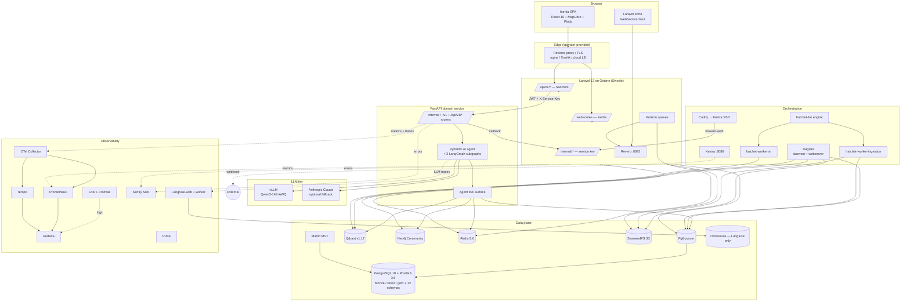

# Solution Architecture Document — GeoRAG Intelligence

> Navigation overlay over the live system at `C:\Users\GeoRAG\Herd\georag`.
> Routes into `georag-architecture.html` (master spec), `docs/adr/`,
> `docs/architecture/*_spec.md` and `docs/architecture/*_design.md` design
> notes, and `docs/SERVICE_INVENTORY.md`. **Never restates schema or
> contract detail that DFS, API_DOCUMENTATION, or the canonical sources
> already own — links to them.**
>
> If code and a canonical source disagree, code wins.

---

## 1. System overview

### 1.1 Product summary

GeoRAG is a geological intelligence platform that ingests decades of fragmented mineral-exploration data — drill logs, NI 43-101 reports, geophysical surveys, GIS layers, public-geoscience registries — and lets geologists query the corpus in natural language. Answers carry mandatory citations to source chunks, are accompanied by map / drill-hole / chart visualizations, and can be exported to industry modelling tools (GeoPackage, Shapefile, DXF, Leapfrog-friendly CSV bundles).

Designed for **private-cloud or on-premise** deployment. No SaaS in the critical path; all third-party dependencies are MIT / BSD / Apache 2.0 / MPL-2.0.

### 1.2 Primary users
- **Field & office geologists** at junior mining and exploration companies. The chat surface ships a Field/Office mode toggle (CC-01 work).
- **Exploration managers / portfolio leads** — Foundry portfolio dashboards, ingestion-health, target-recommendation cockpit.
- **Operators / data engineers** — Dagster web-server, Hatchet workflow UI, silver-review queue, audit-log inspector.
- **Compliance / audit reviewers** — Trust Inspector drawer, citation feedback, refusal-rate dashboards.

### 1.3 Business purpose

Turn private exploration archives into a queryable, citation-bound knowledge base for junior miners that cannot afford an in-house data team. The hallucination-prevention discipline (6 layers + repair loop) is what differentiates the product — refusals are first-class, not failures.

Authoritative product context: [`../../README.md`](../../README.md), [`../../CLAUDE.md`](../../CLAUDE.md), [`../../georag-architecture.html`](../../georag-architecture.html).

---

## 2. Architecture summary + topology

### 2.1 Stack

| Layer | Technology |
|---|---|
| Frontend | React 19 + Inertia.js v3 + TypeScript, shadcn/ui + Radix + Tailwind v4, MapLibre GL, React Flow, Plotly. |
| Application | Laravel 13 on PHP 8.4/8.5, served by Octane (Swoole). Horizon (queues) + Reverb (WebSockets) + Pulse (metrics) + Sanctum (auth). |
| Domain service | FastAPI 0.135.x on Python 3.13. Pydantic AI for agentic orchestration. asyncpg / redis.asyncio / async Neo4j / async Qdrant — async-native only (CLAUDE.md hard rule 2). |
| Ingestion orchestrators | Dagster (assets, sensors, schedules) for bulk pipelines. Hatchet (lite engine + ingestion + ai worker pools) for durable workflows with retries. Kestra for inbound webhooks + outbound notifications + integration edge. |
| Primary database | PostgreSQL 18.3 + PostGIS 3.6.3 via PgBouncer (edoburu 1.25.1-p0, transaction-pool mode). |
| Vector store | Qdrant v1.17 — canonical collection `georag_chunks` (ADR-0010). |
| Graph store | Neo4j Community 2026.03. No Enterprise features (CLAUDE.md hard rule 9). |
| Cache / pub-sub | Redis 8.6.3-alpine. |
| Object storage | SeaweedFS (S3-compatible) per ADR-0001 — compose svc retains legacy name `minio`. |
| Tile serving | Martin 1.7.0 (MapLibre-compatible MVT). |
| LLM runtime | vLLM v0.21.0 serving Qwen3-14B-AWQ (compose-default; canonical model live in `docker-compose.yml::vllm::command`). Anthropic Claude wired as optional fallback. |
| Embeddings / reranker / sparse | `BAAI/bge-small-en-v1.5` + `BAAI/bge-reranker-base` (revision `2cfc18c9415c…`, logit score range [-1, +1]) + `naver/splade-cocondenser-ensembledistil` (SPLADE++). |
| Auth | Sanctum (bearer + SPA cookie). FastAPI: `X-Service-Key` shared secret + Laravel-minted JWT with kid rotation. |
| Workflow / streaming | Reverb (Laravel WebSocket server) — channel catalog in [`API_DOCUMENTATION.md`](API_DOCUMENTATION.md) §6. |
| Observability | Prometheus, Grafana, Loki + Promtail, Tempo, OTel Collector, Pulse. Sentry SDK (Laravel + FastAPI). Logfire opt-in. |
| Backups | `backup-agent` container + Ofelia cron labels + Hatchet `backup_*` workflows. |
| Secrets | SOPS + age (`.env.production.enc`). |
| Hosting | On-premise / private cloud. Primary: Docker Compose on a single host per environment + SSH-based CD. Alternative: Helm chart at `charts/georag/` (vanilla / k3s / airgap overlays). |

Per-container talks-to + healthcheck reality: [`../SERVICE_INVENTORY.md`](../SERVICE_INVENTORY.md). Image-digest evidence: [`../../ops/audit/2026-04-19-image-digests.json`](../../ops/audit/2026-04-19-image-digests.json).

### 2.2 Topology

### 2.3 Profile-gated compose stack

**33 services** in the main `docker-compose.yml`, organised into profiles to keep the dev workstation tractable:

- `dev-light` — PostgreSQL, PgBouncer, Redis, Laravel Octane, Horizon, Reverb, FastAPI.
- `dev-data` — Neo4j, Qdrant, SeaweedFS.
- `dev-ingest` — Dagster daemon + webserver.
- `dev-monitor` — Prometheus + Grafana (+ Loki, Tempo, OTel via overlay).
- `dev-llm` — vLLM.
- `dev-full` — everything.

**5 compose overlays** under `docker/`:
- `compose.exporters.yml` — Prometheus exporters for Postgres / Redis.
- `compose.langfuse.yml` — Langfuse (ClickHouse + langfuse-web + langfuse-worker + langfuse-init).
- `compose.vllm.yml` — alternate vLLM overlay (HF cache volume).
- `compose.wal-archiving.yml` — Postgres WAL archiving + `pg_wal_archive` volume.
- `compose.redis-staging.yml` — staging Redis topology.

**`georag` bridge network** is the single network. **23 named volumes**.

---

## 3. Component architecture

### 3.1 Frontend (Inertia SPA)

`resources/js/` — React 19 + TypeScript + Inertia v3.

- **Pages**: `resources/js/Pages/` — server-routed via `Inertia::render(...)`. Top-level pages plus `Foundry/` (~33 pages), `Admin/` (~36 pages incl. `Admin/AgentConfig/`, `Admin/ShadowRuns/` subdirs), `Dashboards/`, `Onboarding/`, `PublicGeoscience/`. Full file list: `HANDOVER_MANIFEST.md` §20.
- **Layouts** (`resources/js/Layouts/`): `AppLayout.tsx`, `DashboardLayout.tsx`, `FoundryShell.tsx`.
- **Hooks** (`resources/js/Hooks/`): `useWorkspaceDataUpdated`, `useWorkspaceActivity`, `useUserInbox`, `useAdminSurfaceUpdated`, `useTileInvalidation`, `useEventDedup`, `useEvidenceMapPin`, `useFullscreenToggle`.
- **Shared components** (`resources/js/Components/`): MapView, GeoPlot, KnowledgeGraph, DrillTrace3D, DrillHoleBrowser, HoleDetailSheet, ChatMessage, InlineViz, ProjectSelector, ErrorBoundary, ExperienceModeToggle, plus `Foundry/`, `Admin/`, `Analytics/`, `HoleAnalysis/`, `GuardError/` subdirs.
- **Inertia shared props** (`app/Http/Middleware/HandleInertiaRequests::share`): `auth.user`, `flash`, `app.{env,debug}`, `basemap_styles` (⚠ references missing config key — see [`HANDOVER_INDEX.md`](HANDOVER_INDEX.md) §5.2), `guard_errors` (i18n catalog from `lang/en/guard_errors.php`), `project_threads`, `project_saved_views`, `inbox_count`, `review_count`.
- **Client init** (`resources/js/app.tsx`): `import.meta.glob('./Pages/**/*.tsx')` without `eager:true` for per-page code-splitting; root `ErrorBoundary`; Inertia progress bar `#f59e0b`, no spinner; 8 font-weight imports.
- **Tailwind v4** (`resources/css/app.css`): `@import 'tailwindcss'` + 6 `@source` globs; 17 OKLCH Foundry palette tokens (Wave 0 rev 7); Inter Tight + Instrument Sans + JetBrains Mono.
- **Vite** (`vite.config.ts`): laravel-vite-plugin + @vitejs/plugin-react + @tailwindcss/vite. SSR entry at `resources/js/ssr.tsx`. `@/*` path alias → `resources/js/*`.

Routing reference: [`API_DOCUMENTATION.md`](API_DOCUMENTATION.md) §3.

### 3.2 Application / Laravel

`app/`, `routes/`, `config/`, `bootstrap/app.php`.

- **Entry**: Laravel Octane on Swoole, host port `APP_PORT` (default `80`; dev override `8888`). Container built via `docker/laravel.Dockerfile`.
- **Bootstrap middleware** (`bootstrap/app.php`):
  - `InjectTraceparent` — W3C Trace Context (mint/accept inbound, echo on response).
  - `SecurityHeadersMiddleware` — XFO/XCTO/Referrer/Permissions + conditional HSTS + CSP. Detail in [`API_DOCUMENTATION.md`](API_DOCUMENTATION.md) §8.5.
  - `trustProxies` driven by `TRUSTED_PROXIES`.
  - Web stack appends `HandleInertiaRequests`.
  - API stack prepends `EnsureFrontendRequestsAreStateful` (Sanctum SPA).
  - `service.key` middleware alias → `VerifyServiceKey` (`FASTAPI_SERVICE_KEY` shared secret).
  - Health endpoint at `/up`.
- **Routes** (verified live 2026-05-29): 61 direct + 6 `Route::resource` declarations in `routes/api.php` (67 entries; ~91 effective endpoints post-resource expansion), 155 in `routes/web.php`. Full inventory in [`API_DOCUMENTATION.md`](API_DOCUMENTATION.md) §3 + §4.
- **Service providers**: `AppServiceProvider`, `CitationResolverServiceProvider`, `HorizonServiceProvider`.
- **Authorization gates** (`AppServiceProvider`): `viewPortfolio`, `viewProject` (delegated to `DashboardPolicy`), `admin` (`is_admin` bool). `viewHorizon` is email-allowlist in `HorizonServiceProvider`.
- **Queues** — Horizon supervises Redis-backed queues. Two supervisors: `supervisor-1` (default queue, balance `auto`, prod cap 10) and `supervisor-llm` (queue `llm`, balance `simple`, prod cap `HORIZON_LLM_MAX_PROCESSES` default 4). Jobs: `GenerateExportJob`, `StreamQueryFromFastApi`, `DebounceWorkspaceMvRefresh`.
- **Services layer** (`app/Services/`): `Agents/` (AgentInvoker + AgentContext + AgentResult), `Audit/`, `Citations/`, `Dagster/`, `DecisionIntelligence/`, `Figures/`, `Guards/`, `Ingestion/` (`ShadowRouter`, `WorkspaceDataVersionBumper`), `Exports/` (10 exporters: CsaBundle / Csv{Assays,Collar,Geochemistry,Lithology,Samples} / Dxf / GeoPackage / LasBundle / Shapefile), `FastApiJwtMinter` (kid-rotation JWT for FastAPI service-to-service).
- **Eloquent models** (`app/Models/`): `User`, `Project`, `Collar`, `Survey`, `LithologyLog`, `Alteration`, `Structure`, `Sample`, `Geochemistry`, `WellLogCurve`, `Report`, `ChatConversation`, `ChatMessage`, `Export`, `VendorProfile`, `ColumnMapping`, `SavedMapView`, `QueryAuditLog`. Sub-namespaces: `Silver/` (DecisionRecord + DecisionOption + DecisionEvidenceLink + DecisionOutcome + DecisionLessonLearned + Hypothesis + HypothesisEvidenceLink), `Targeting/` (TargetRecommendation + TargetOutcome + TargetReviewDecision), `PublicGeoscience/` (Jurisdiction + PublicGeoSource), `Eval/` (GoldenQuestion), `Ops/` (SupportTicket + SupportTicketTrace + SupportReplayRun).
- **Artisan commands** (`app/Console/Commands/`): `DumpAuditPii`, `EncryptExistingAuditPii`, `RestoreAuditPii`, `RotateAuditKey`, `GoldenSetReport` + `Ingestion/` subdir.

### 3.3 Domain service / FastAPI

`src/fastapi/`. Entry `app/main.py`.

- **Container** (`docker/fastapi.Dockerfile`): two-stage Python 3.13-slim. Runtime apt: `libpq5`, GDAL (`gdal-bin`, `libgdal36`), `libgeos-c1t64`, `libproj25`, `tesseract-ocr`, `poppler-utils`, image libs (`libgl1`, `libcairo2`, `libpango-1.0-0`, `libpangoft2-1.0-0`, `libgdk-pixbuf-2.0-0`, `libglib2.0-0`). Healthcheck `curl /health`. CMD: `uvicorn app.main:app --host 0.0.0.0 --port 8000 --workers ${UVICORN_WORKERS:-6} --no-access-log --proxy-headers --forwarded-allow-ips '*' --timeout-graceful-shutdown 30 --header "server:GeoRAG"`.
- **Lifespan** (`app/main.py`): initialises asyncpg pool, async Qdrant, async Neo4j, redis.asyncio, optional pooled `anthropic.AsyncAnthropic`, SentenceTransformer (`BAAI/bge-small-en-v1.5` CPU/GPU per `EMBED_DEVICE`), CrossEncoder (`BAAI/bge-reranker-base` CPU). Sentry SDK init gated on `SENTRY_DSN`; Logfire init gated on `LOGFIRE_ENABLED`.
- **Middleware** (`app/middleware.py`): `BodySizeLimitMiddleware` (413 over `MAX_REQUEST_BODY_BYTES`), `GlobalTimeoutMiddleware` (504 over `REQUEST_TIMEOUT_S`), `StructuredAccessLogMiddleware` (JSON access log + W3C traceparent).
- **Settings** (`app/config.py`): Pydantic `BaseSettings` with 135 typed fields. Timeout budgets: `REQUEST_TIMEOUT_S=30`, `AGENTIC_TIMEOUT_S=10`, `TIMEOUT_POSTGIS_S=5`, `TIMEOUT_NEO4J_S=3`, `TIMEOUT_QDRANT_S=2`, `TIMEOUT_RERANKER_S=8`, `TIMEOUT_REDIS_S=0.5`, `TIMEOUT_GATHER_S=8`, `KESTRA_HTTP_TIMEOUT_S=5`, `PAGERDUTY_HTTP_TIMEOUT_S=5`.
- **Routers** (`app/routers/` — 32 files): 109 endpoints in 6 URL families. Catalog + per-endpoint table in [`API_DOCUMENTATION.md`](API_DOCUMENTATION.md) §5.
- **Service classes** (`app/services/` — ~50 modules): auth, persistence (`answer_run_store`, `bronze_store`, `citation_lifecycle`, `claim_ledger`, `conversation_state_store`, `cross_store_consistency`, `cross_workspace_audit`, `silver_dq_flag_writer`, `trace_writer`, `seaweedfs_keys`), retrieval (`qdrant_service`, `qdrant_fallback`, `sparse_encoder`, `fusion`, `reranker`, `identifier_boost`, `geological_query_expansion`, `domain_classifier`, `query_classifier`, `span_resolver`, `kg_normalizer`, `graph_entity_resolver`), PDF parse (`pdf_extract`, `pdf_layout`, `pdf_ocr`, `pdf_preflight`, `pdf_render`, `pdf_vl`), reasoning (`assessment_summarizer`, `completeness_audit`, `conflict_detector`, `decision_intelligence/`, `report_builder/`, `targeting/`, `target_recommendation/`, `target_scoring_ml/`, `geological_ontology/`, `geological_reasoning/`, `llm_incident_diagnosis/`), bridges (`laravel_bridge`, `project_name_resolver`, `refusal_builder`, `review_lineage_lookup`, `source_trust/`, `support_cockpit/`, `tool_gateway/`, `visualizations/`, `publicgeo/`, `dispatchers/`, `ingest/`, `eval/`, `shadow_diff/`).

#### 3.3.1 Agent catalogue (42 `@georag_agent` operational agents)

Decorator contract: `app/agents/wrapper.py::georag_agent(name, risk_tier, version)`. Per-invocation lifecycle: load `workspace.agent_timeouts` (60s in-process cache, `_TIMEOUT_CACHE_TTL=60.0`) → circuit-breaker check (Redis, per-workspace OR global per policy `circuit_breaker_scope`) → idempotency-key lookup for R2+ (`workspace.idempotency_keys`; R0/R1 skip) → run under `asyncio.wait_for(hard_timeout)` → persist idempotency row → emit `usage.usage_events` → update breaker counters (success resets, failure increments + sets `EXPIRE = cool_down_seconds` sliding TTL) → emit `audit.audit_ledger` row → return `AgentResult(value, outcome, ctx)`. **Never raises** — callers always get an `AgentResult`.

**Risk-tier enum** (`app/services/tool_gateway/policies.py::RiskTier`):
- **R0** read-only — no idempotency, no breaker by default.
- **R1** internal suggestion — no idempotency.
- **R2** internal write (policy check) — idempotency key from `(workspace_id, document_id, ...)`; ~30-day TTL on cached result (covers ingest-then-revisit cycle).
- **R3** external notification (policy + audit) — idempotency key from `(workspace_id, export_request_id, ...)`.
- **R4** external publish (approval required) — idempotency key from `(workspace_id, sync_target, sync_request_id, ...)`.
- **R5** destructive/bulk (sign-off + QP credential) — idempotency key from `(workspace_id, target_id, signoff_session_id, ...)`.

Circuit-breaker key shape: `agent:{name}:{scope}:{workspace_id_or_global}`. Idempotency row eviction: nightly `idempotency_keys_cleanup` workflow drops rows where `expires_at < now()`.

**By phase** (full list in `HANDOVER_MANIFEST.md` §2):

- Phase 0 — infrastructure (11): `graph_tenant_auditor`, `index_health`, `lineage_reporter`, `llm_incident_diagnosis`, `model_cost_summary`, `model_upgrade_watch`, `storage_tiering`, `store_reconciliation`, `support_packet`, `tenant_isolation_auditor`, `vllm_security_check`.
- Phase 5 — visual QA (2): `drillhole_visual_qa`, `visual_readiness`.
- Phase 6 — public/private boundary (1): `public_private_boundary`.
- Phase 7 — report production (8): `appendix_builder`, `claim_validator`, `conflict_resolver`, `evidence_curator`, `export_compliance`, `map_chart_planner`, `presentation_coach`, `report_planner`.
- Phase 8 — targeting (11): `backtesting`, `candidate_generation`, `constraint`, `deposit_model`, `evidence_layer`, `field_outcome`, `geologist_signoff`, `recommendation_explainer`, `scenario_planning`, `target_scoring`, `uncertainty`.
- Phase 9 — discovery (4): `analogue_finder`, `hypothesis_generator`, `next_best_data`, `spatial_relationship`.
- Phase 10 — support ops (5): `customer_response_drafting`, `escalation_routing`, `root_cause_investigation`, `support_packet`, `ticket_triage`.

Which agents run in which Hatchet worker pool: [`CICD_PIPELINE.md`](CICD_PIPELINE.md) §6.3.

#### 3.3.2 LangGraph subgraphs (3) + intent labels (8)

Three `StateGraph` instantiations, each with its own state schema + node module + auxiliaries.

**Graph A — `agentic_retrieval`** (`app/agent/agentic_retrieval/`)
- `state.py` → `AgenticRetrievalState` (TypedDict)
- `graph.py` → graph wiring
- `nodes.py` → node functions (classify → preprocess → retrieve → rerank → answer → persist)
- `intent_classifier.py` → 8-way intent classifier
- `preprocessor.py` → query rewrite + ContextEnvelope coercion
- `retrieval_profile.py` → per-intent retrieval profile (k, fusion weights, rerank toggle, parent expansion, MMR)
- `qaqc_availability.py` → declares which silver QA/QC fields are present (drives the anomaly-detection retrieval profile + Layer 4 entity-resolution gate)
- `context_envelope.py` → 12-field `ContextEnvelope(BaseModel)`
- Codified by ADR-0006 ("one LangGraph + six routed intents"). Generalised from 6 → 8 intents by ADR-0007 ("Chat-embedded interactive cards" — adds `project_summary` + `coverage_gap`). Status: live since 2026-05-25. Flag `AGENTIC_RETRIEVAL_V2_ENABLED` default off in dev → flip per-workspace.

**Graph B — `report_builder`** (`app/services/report_builder/`)
- `state.py` → `ReportBuilderState`
- `graph.py` → graph wiring
- `nodes.py` → node functions (plan → gather sections → render → assemble appendix)
- `templates.py` → Jinja2 report templates
- `renderers/` → format-specific renderers (PDF / HTML / DOCX)
- `whatchanged_integration.py` → diff against last produced report; feeds `Admin/WhatChanged` Inertia feed

**Graph C — `target_recommendation`** (`app/services/target_recommendation/`)
- `state.py` → `TargetRecommendationState`
- `graph.py` → graph wiring
- `nodes.py` → node functions (gather evidence layers → score candidates → SME-content lookup → explain)
- `deposit_models.py` → deposit-type model library (IOCG / orogenic Au / VMS / porphyry etc.)
- `sme_content/` → SME-authored explanation snippets

**Intent labels** (`app/agent/agentic_retrieval/intent_classifier.py`): `factual_lookup`, `synthesis`, `hypothesis_generation`, `anomaly_detection`, `uncertainty_quantification`, `decision_support`, `project_summary`, `coverage_gap`. Each intent has its own retrieval profile + OIUR prompt section (Observation / Interpretation / Uncertainty / Recommendation — see [Phase 1 geologist-question plan] memory).

**ContextEnvelope** (`app/agent/agentic_retrieval/context_envelope.py`): 12-field `ContextEnvelope(BaseModel)` mirrored client-side in `StoreQueryRequest`. Typed literals: `DepthReference`, `DataSource`, `QueryMode`, `ReportingCode`. Defaults: `DEFAULT_QUERY_MODE="office"`, `DEFAULT_REPORTING_CODE="NI 43-101"`. `effective_reporting_code()` returns `(code, was_defaulted)` driving the `guard_errors` Inertia prop's partial-answer scaffolding.

#### 3.3.3 Prompt registry + routing (20 prompt modules)

`app/agent/prompts/` is the centralised prompt library. Two routing axes:

1. **System-prompt routing** (flag `SYSTEM_PROMPT_ROUTING_ENABLED`) — `app/agent/model_routing.py` selects an orchestrator prompt variant per intent + envelope. Four orchestrator families × two punctuation variants = 8 files:
   - `orchestrator_default_{colon,dash}.py`
   - `orchestrator_graph_{colon,dash}.py` (graph-heavy retrieval contexts)
   - `orchestrator_narrative_{colon,dash}.py` (synthesis / hypothesis_generation)
   - `orchestrator_numeric_{colon,dash}.py` (factual_lookup / anomaly_detection / uncertainty_quantification)
   - `orchestrator_shared_preamble_{colon,dash}.py` — common preamble injected into all four families
   - Colon vs dash: separator style empirically affects Qwen3-14B-AWQ instruction-following — A/B tested via the eval harness.

2. **Model routing** (flag `MODEL_ROUTING_ENABLED`) — `model_routing.py` selects a cost/capability tier per query, then resolves the tier to a concrete model per backend.

   **Tier enum** (`ModelTier`):
   - `FAST` → `MODEL_TIER_FAST` (default `claude-haiku-4-5`)
   - `STANDARD` → `MODEL_TIER_STANDARD` (default `claude-sonnet-4-6`)
   - `DEEP` → `MODEL_TIER_DEEP` (default `claude-opus-4-8`, falls back to `ANTHROPIC_MODEL`)

   **`select_tier(categories, retry_count)` priority order** (first match wins):
   1. `MODEL_ROUTING_ENABLED=False` → always `DEEP`
   2. `retry_count > 0` → `DEEP` (correction loop needs the stronger model to self-correct hallucinations)
   3. `categories["classifier_fallback"]` true → `DEEP` (keyword classifier missed; subtle query, premium model)
   4. `categories["graph"]` or `["targeting"]` true → `DEEP` (multi-hop entity reasoning / drill-target optimisation — cheaper models fabricate relationships here)
   5. `categories["documents"]` or `["public_geo"]` true → `STANDARD` (narrative synthesis with citation enforcement)
   6. Only structured buckets active (`spatial`/`assay`/`downhole`) → `FAST` (pure factoid; LLM just narrates numbers)
   7. Anything else → `STANDARD` (safe default)

   **Backend resolution** (`tier_to_model_for_backend(tier, backend)`):
   - `backend == "anthropic"` → resolve via the tier table above.
   - `backend == "vllm"` → **always returns `VLLM_MODEL`** regardless of tier. Single-instance vLLM serves one checkpoint chosen at `--model` startup; multi-tier on vLLM would require multiple processes, not viable on the A4500. Cost/capability shaping happens entirely on the Anthropic side; multi-instance vLLM tiering deferred to production-readiness scope.

   Routing inputs also include `usage.workspace_cost_ceilings` (cost-burn watcher can downshift), `LLM_FALLBACK_ENABLED` (gates the vLLM→Anthropic failover entry), and `is_retriable_via_failover()` (which exceptions trigger Anthropic fallback).

Other prompt modules:
- `_version_registry.py` — prompt-version pinning (per-workspace via `workspace.prompt_versions`)
- `agent_system.py` — per-agent system prompt shared by all 42 `@georag_agent` instances
- `classifier_system.py` — intent classifier prompt
- `rephrase_system.py` — query rewrite prompt
- `oiur_section.py` — OIUR answer-structure prompt section
- `decision_support_section.py` — decision-support intent overlay
- `answer_emphasis_section.py` — citation-bind emphasis
- `structured_answer_format.py` — output-schema injection
- `example_system.py` — few-shot example block

Prompt admin surface: `Admin/AgentConfig/Prompts` Inertia page → writes to `workspace.prompt_versions` → `_version_registry.py` resolves at agent invocation time.

#### 3.3.4 Non-decorated agent-tier modules

Modules under `app/agent/*.py` that are NOT `@georag_agent` decorators but participate in the agent runtime (called from nodes, tools, or the orchestrator). They have no decorator-managed circuit-breaker / idempotency / audit lifecycle — they are pure functions or service classes.

| Module | Role |
|---|---|
| `agentic_escalation.py` | Escalates a query mid-graph to a higher-capability path; flag `AGENTIC_ESCALATION_ENABLED` + `AGENTIC_FULL_ESCALATION_ENABLED`. |
| `anaphora.py` | Multi-turn coreference resolution; flag `MULTI_TURN_RESOLUTION_ENABLED`. |
| `anomaly_detector.py` | Statistical outlier surfacing for `anomaly_detection` intent. |
| `authority.py` | Per-tool authority check (read/write/external classification). |
| `citation_binding.py` | Binds Pydantic AI typed-output citations to `silver.answer_citation_items` rows. |
| `confidence_computer.py` | Computes per-claim confidence score (drives Layer 5 provenance gate). |
| `context_budget.py` + `context_builder.py` + `context_prep.py` | Context assembly + budget enforcement (flag `CONTEXT_PREP_ENABLED`). |
| `decision_support_classifier.py` | Sub-classifier for `decision_support` intent. |
| `decomposer.py` | Multi-hop query decomposition into sub-queries. |
| `deps.py` | `AgentDeps` dependency injection container + `acquire_scoped` RLS contract (see §4.2). |
| `document_classifier.py` | Document-domain classification (drives `silver.document_domain_tag`). |
| `drill_targeting.py` | Drill-target scoring shim used by `Phase 8 — targeting` agents. |
| `egress_gate.py` | External-egress check for R3+ tools (blocks if `MULTI_TENANT_ENFORCEMENT_ENABLED=false`). |
| `entity_resolver.py` | Layer 4 entity resolution (flag `ENTITY_RESOLUTION_ENABLED` + `_SHADOW_ENABLED`). |
| `escalation.py` | Generic escalation to Claude fallback. |
| `event_stamper.py` | Stamps Hatchet workflow events with workspace + run context. |
| `evidence.py` + `evidence_converter.py` | Evidence-item assembly for `silver.evidence_items` (targeting). |
| `figure_extractor.py` | Figure/caption extraction from `silver.report_figures` (used by report_builder + chat cards). |
| `followups.py` | Suggested-followup question generation. |
| `geospatial_planner.py` | Spatial query planning (PostGIS bbox + radius + buffer). |
| `golden_query_harness.py` | In-graph evaluation against `eval.golden_questions` (see §3.3.6). |
| `graph_entities.py` | Neo4j entity lookup helpers. |
| `guards.py` | 18-code `GuardErrorCode` enum (Spine A — see §4.1). |
| `lineage.py` | Reads `silver.structured_record_lineage` for provenance trails. |
| `llm_calls.py` | Centralised LLM call wrapper (Qwen + Claude unified API). |
| `llm_classifier.py` | LLM-backed classifier fallback (flag `LLM_CLASSIFIER_FALLBACK_ENABLED`). |
| `log_safe.py` | PII-safe logging helpers. |
| `model_routing.py` | Model + prompt routing (see §3.3.3). |
| `multi_turn_resolver.py` | Multi-turn context resolution. |
| `oiur_parser.py` | Parses OIUR-structured LLM output. |
| `pdf_tool_results.py` | PDF tool-call result envelope. |
| `pipeline/` | `branching.py`, `decomposition.py`, `verification.py` — pipeline stage helpers. |
| `orchestrator/run_cache.py` | Per-run cache for repeated tool calls within a graph execution. |
| `plan_executor.py` | Executes the planner output (decomposer + executor pair). |
| `pricing.py` | Per-model token pricing for `usage.usage_events`. |
| `project_geometry.py` | Project-boundary geometry resolution. |
| `public_geoscience_tool.py` | SMDI / MINFILE / MRDS lookup tool. |
| `query_classification.py` | Pre-intent query family classification. |
| `repair_apply.py` + `repair_strategy.py` | 13-strategy `RepairStrategy` dispatcher (Spine B — see §4.1). |
| `response_assembler.py` | Final response envelope assembly with citations + guard_errors. |
| `sentry_tags.py` | Sentry tag injection. |
| `source_diversity.py` | Source-diversity scoring (anti-monoculture in retrieval). |
| `spatial_temporal_verify.py` | Layer 3 numerical + spatial-temporal verification. |
| `tool_result_helpers.py` | Tool-result coercion + shape validation. |
| `tools.py` + `tools_geospatial.py` | The agent's tool surface (Pydantic AI `@agent.tool` registrations). |
| `viz_builder.py` | Visualization payload builder for chat cards. |
| `schemas/` | Pydantic models for tool I/O + agent contracts. |

#### 3.3.5 ML / fine-tune lifecycle

**Active ML inference (production-bound):**
- `app/services/target_scoring_ml/`
  - `xgboost_inference.py` — XGBoost target-scoring model. Inputs: evidence-layer features from `silver.evidence_items`. Outputs: written to `silver.target_recommendations`.
  - `shap_writer.py` — SHAP feature attributions; written to `targeting.target_score_factors` for explainability.
  - `ab_comparison.py` — A/B model-version comparison harness.
- `app/services/reranker.py` — **`BAAI/bge-reranker-base`** (revision `2cfc18c9415c…`, logit score range [-1, +1]). CPU-bound, hard-timeout 8s wall + `RERANKER_TIMEOUT_S=2.0` per 50-candidate batch, `torch.set_num_threads(10)`, pre-truncate to 2000 chars, candidate count halved to 10 (see [Latency fix 2026-05-20] memory). RRF fallback on timeout/error (no hard failure per Spec B6 fallback policy).
  - **Per-class top-K candidate budget** (`RERANKER_TOP_K_BY_CLASS`): `factual=20`, `spatial=30`, `document=15`, `computation=10`, `viz=30`, `unknown=20`. Default `RERANKER_TOP_K_DEFAULT=20`.
- `app/services/sparse_encoder.py` — SPLADE++ (`naver/splade-cocondenser-ensembledistil`) sparse query encoder. Hybrid-fused with dense bge-small at retrieval time.
- `app/services/embeddings.py` — `BAAI/bge-small-en-v1.5` dense embedder. CPU 3-4 chunks/s vs GPU 144 chunks/s on the A4500 (see [GPU acceleration 2026-05-22] memory).

**Fine-tune programs (mixed status):**

| Program | Status | ADR | Checkpoint location | Notes |
|---|---|---|---|---|
| bge-small domain adaptation | Accepted 2026-05-27 | ADR-0008 (Option D) | TBD | Approach: synthetic geological MLM corpus + contrastive triplets from `eval.golden_questions`. Eval harness gates promotion. |
| bge-reranker-base in-place FT | **HOLD** 2026-05-29 | ADR-0011 (Proposed) | `s3://reranker-checkpoints/v1/run_id=2026-05-29-mlm-extended/` (MLM-adapted backbone preserved for future cycles) | Two HOLD verdicts in one day: §38 full FT on synthetic + §39 LoRA on 19 real production queries, both lost to stock. Root cause: only 27 distinct production queries exist (nightly bench reruns). **Do NOT re-pitch reranker FT until real user query volume arrives.** (See [Reranker overnight 2026-05-29] memory.) |
| bge-reranker-v2-m3 + GPU host upgrade | Deferred | ADR-0003 | — | Deferred pending GPU host upgrade. |
| Reranker domain adaptation (vocab + MLM + full FT) | Proposed | ADR-0011 | (overlapping with above) | Pipeline structure: vocabulary extension → MLM continued pretraining → full FT. Stage 1+2 landed; stage 3 on HOLD. |

**ML admin surface:**
- `Admin/MlTrainingRuns.tsx` Inertia page (`/admin/ml-training` route) — surfaces training runs, metrics, promotion-gate decisions.
- `Admin/AgentConfig/` — agent timeouts (per-workspace overrides in `workspace.agent_timeouts`), prompt-version pins (`workspace.prompt_versions`).
- `Admin/ShadowRuns/` — shadow-traffic comparison runs (Layer 4 entity-resolver shadow, repair-loop shadow tier).

**Reranker-checkpoint storage:** SeaweedFS `reranker-checkpoints` bucket (not enumerated in compose; deployed manually). Run IDs follow `run_id=YYYY-MM-DD-<tag>/` convention.

#### 3.3.6 Eval harness + golden-query gate

`app/services/eval/` is the evaluation runtime that implements CLAUDE.md's milestone gate ("Golden query tests and hallucination failure tests are milestone gates").

| Module | Role |
|---|---|
| `real_rag_evaluator.py` | End-to-end RAG eval against `eval.golden_questions` — runs the full agentic_retrieval graph + scores answers against expected citations. |
| `real_llm_evaluator.py` | LLM-only eval (no retrieval) — measures Qwen vs Claude on closed-book questions. |
| `workspace_evaluator.py` | Per-workspace eval — applies workspace-specific prompt + model pins from `workspace.prompt_versions` + `workspace.agent_timeouts`. |
| `ndcg_harness.py` | nDCG@k retrieval-quality scoring. |
| `benchmark_compare.py` | Diff two run summaries; produces `Admin/EvalCompare` payload. |
| `promotion_gate.py` | Model-promotion gate: blocks if regression vs baseline on any tier. |
| `thresholds.py` | Per-metric promotion thresholds (configurable). |
| `validators.py` | Output-schema validators for golden-question expectations. |
| `seeds.py` | RNG seed management for reproducibility. |
| `mechanical_questions/` | Mechanical-question generators (depth/azimuth/grade extraction tests). |

**Storage:** `eval.golden_questions` (canonical question set), `eval.run_results` (per-question per-run), `eval.run_summaries` (per-run aggregate).
**Admin surface:** `Admin/EvalDashboard`, `Admin/EvalCompare`, `Admin/EvalQuestions/EvalQuestionEditor`.
**Eloquent model:** `app/Models/Eval/GoldenQuestion.php`.
**In-graph evaluation:** `app/agent/golden_query_harness.py` lets a graph run be replayed against the golden set without leaving FastAPI.

**2026-06-01 ChatGPT gap import:** 1500 questions imported into `eval.golden_questions` via `database/seeders/GapImportCsvSeeder.php` + migration `2026_06_01_120000_extend_golden_questions_set_check.php`. Bucketing (per the CSV `project` column, NOT filename — the 1000-CSV is mixed): 1350 single-project + 150 cross-project, all `is_active=true`. Two new `question_set` enum values added to the CHECK constraint: `gap_import_single_project`, `gap_import_cross_project`. Source: [ChatGPT gap import 2026-06-01] memory.

#### 3.3.7 Retrieval-quality overhaul (2026-06-02)

Five new FastAPI services + 6 new feature flags landed in the 2026-06-01 → 2026-06-02 overnight session targeting the imported gap-question set. Honest measurement: single-project pass rate ~80% (40/50), cross-project ~43% (43/100). Remaining failures are mostly real corpus gaps (sub-property questions about content not yet ingested). Full session log: `OVERNIGHT_2026_06_02.md`.

**Live in production (flags ON by default):**

| Service module | Flag | Behaviour |
|---|---|---|
| `app/services/multi_query_expansion.py` | `MULTI_QUERY_EXPANSION_ENABLED=True` | Pre-retrieval LLM expands the query into `MULTI_QUERY_EXPANSION_N=3` alternative phrasings (synonym swap, HyDE-style hypothetical answer, entity-focused). Fan-out + union by `chunk_id`. Redis-cached for `MULTI_QUERY_EXPANSION_CACHE_TTL_S=86400` (24h). Per-call timeout `MULTI_QUERY_EXPANSION_TIMEOUT_S=6.0`. Catches naming mismatches between query vocabulary and corpus vocabulary. |
| `app/services/multi_project_decomposition.py` | `MULTI_PROJECT_DECOMPOSITION_ENABLED=True` | When the query mentions 2+ workspace projects, splits into per-project sub-queries. Includes hardcoded `_KNOWN_PROPERTY_NICKNAMES` list mapping parent-company → child properties (e.g. WRLG → Dixie/PureGold/Rowan, Battle North → Bateman). **Tech-debt note:** nicknames should move to a `silver.project_aliases` table populated during ingestion — see INDEX §5. |
| `app/services/atomic_claim_extractor.py` | `CITATION_FIRST_ENABLED=True` | **Salvage path only** — fires when the primary LLM call refuses AND document chunks were retrieved. Per-chunk atomic-claim extraction (timeout `CITATION_FIRST_EXTRACTOR_TIMEOUT_S=8.0`, concurrency `CITATION_FIRST_EXTRACTOR_CONCURRENCY=4`), then composes an answer from the claim pool (composer timeout `CITATION_FIRST_COMPOSER_TIMEOUT_S=15.0`). Composer prompt is comparison-aware (A-vs-B structure). **Critical**: composer prompt explicitly forbids refusal-language openers ("I cannot", "I don't have", etc.) because they trip the `response_assembler._is_refusal` regex. |

**Live in production (flags OFF, ready to flip):**

| Service module | Flag | When to flip |
|---|---|---|
| `app/services/sentence_grounding.py` | `SENTENCE_GROUNDING_ENABLED=False` | NLI-style per-sentence verifier. `SENTENCE_GROUNDING_MAX_SENTENCES=12` per answer, `_PER_SENTENCE_TIMEOUT_S=4.0`, concurrency 4, 24h Redis cache. Adds ~150-300ms per cited sentence. Spot-check verdicts on 5-10 real answers before flipping. |
| (same module) | `SENTENCE_GROUNDING_DROP_MODE=False` | Drops unsupported sentences from emit. Flip AFTER `SENTENCE_GROUNDING_ENABLED` has been on long enough to trust precision. |
| `app/services/corpus_summarizer.py` | `SUMMARIZER_ENABLED=False` | Full map-reduce summarisation pipeline. Currently callable as `summarize_scope(...)` for testing but not auto-dispatched. To wire: add an `IntentRoute.SUMMARIZE` case in the intent classifier. Scope timeout `4.0s`, map timeout `8.0s`, reduce timeout `20.0s`, map concurrency `5`, `SUMMARIZER_MAX_CHUNKS=20`. |

**Model contract change:** `GeoRAGResponse` (`src/fastapi/app/models/rag.py`) gains an optional `grounding_report` field populated when `SENTENCE_GROUNDING_ENABLED=True`.

**Validator changes (`app/services/eval/validators.py`):**
- Layer 5 — collection auto-select + compound-ID parser (fixes false-fail citations after ADR-0010 canonical-corpus cutover).
- Layer 1 — recalibrated to ANY rule + threshold `0.3` (was `0.5`) + DATA heuristic. Matches the empirical reranker score distribution and is no longer over-restrictive.

**Query-classifier change (`app/services/query_classifier.py`):** summarisation verbs ("summarize", "summarise", "summary of", etc.) now route to the `DOCUMENT` class (was previously refused).

**Per-feature rollback:** each flag can be flipped independently via `docker exec georag-fastapi sh -c "echo '<FLAG>=false' >> /app/.env" && docker compose restart fastapi`.

### 3.4 Ingestion plane (Dagster + Hatchet)

Data-flow detail in [`DFS.md`](DFS.md) §2. This section names the components only.

- **Dagster** (`src/dagster/georag_dagster/`):
  - `assets/` — **56 top-level asset modules + 5 `bronze_to_silver/` + 7 `silver_to_gold/`** (verified 2026-05-29; supersedes prior 53+4 which omitted the silver_to_gold subdir entirely). Categories: bronze landing, bronze→silver transforms, silver normalisation + DQ, silver→gold projections (the 7 `silver_to_gold/` modules: `assay_composites`, `campaign_summaries`, `drill_summaries`, `element_correlations`, `qaqc_statistics`, `significant_intersections`, `zone_statistics`), index builders (Qdrant + Neo4j + reports).
  - `parsers/` — format-specific parsers (LAS, SEGY, GPKG, NI 43-101 PDF via §04p, CSV/XLSX).
  - `checks/` — **27 `@asset_check` quality gates** across 6 files (silver/evidence/index/interval-overlap/drill-traces).
  - `resources.py` — 5 `ConfigurableResource`s: `PostgresResource`, `S3Resource` (vendor-neutral; replaces `MinIOResource`), `QdrantResource`, `Neo4jResource`, `VllmResource`.
  - `definitions.py` — Definitions registration + 6 schedules + 1 sensor. Schedules + sensor enumerated in [`CICD_PIPELINE.md`](CICD_PIPELINE.md) §6.5.
- **Hatchet** (`src/fastapi/app/hatchet_workflows/`): **52 workflow modules** (verified live 2026-06-02; supersedes prior 45/46 — June feature wave adds `embed_pending_passages_smoke`, `ingest_zip_archive`, `qdrant_payload_audit` plus earlier-but-uncounted modules) + `worker.py` entrypoint with `WORKER_POOL ∈ {ingestion, ai, all}`. Workflow declaration via `hatchet.workflow(name=, on_crons=, input_validator=)`. Task decorator `@workflow.task(execution_timeout, schedule_timeout, retries, parents=[...])`.
  - Shared client: module-scope `hatchet = Hatchet()` in `src/fastapi/app/hatchet_workflows/__init__.py` — both worker entrypoint and workflow modules import the same instance.
  - Connection env (worker side): `HATCHET_CLIENT_TOKEN` (JWT, fails-startup if missing per compose `:?` form), `HATCHET_CLIENT_HOST_PORT=hatchet-lite:7077`, `HATCHET_CLIENT_TLS_STRATEGY=none`.
  - Engine env + worker-pool selection: [`CICD_PIPELINE.md`](CICD_PIPELINE.md) §6.3 + §6.4.

CLAUDE.md hard rule 7 ("Don't duplicate orchestration"): Laravel queues = user-triggered async, Dagster = scheduled bulk, Hatchet = durable workflows + retries, Kestra = integration edge.

### 3.5 Database + storage layer

PostgreSQL 18 + PostGIS 3.6 fronted by PgBouncer (transaction-pool mode). Co-tenant databases inside the same cluster: `georag` (main), `hatchet` (engine state), `georag_dagster` (asset events). Neo4j Community + Qdrant + Redis + SeaweedFS as separate services. ClickHouse only via the `compose.langfuse.yml` overlay (Langfuse-internal, no app access).

**Schema architecture, table inventory, role grants, RLS policy patterns, extension list, MV / trigger / function catalogue → [`DFS.md`](DFS.md) §4.**

### 3.6 Auth / session layer

- **SPA cookie flow** — `GET /sanctum/csrf-cookie` → `POST /api/v1/auth/spa-login`. Session lifetime 120 minutes (`SESSION_LIFETIME=120`).
- **Token flow** — `POST /api/v1/auth/login` returns Sanctum bearer. Expiration `SANCTUM_TOKEN_EXPIRATION=480` minutes (8h). `SANCTUM_TOKEN_PREFIX` empty default → flagged in [`HANDOVER_INDEX.md`](HANDOVER_INDEX.md) §5.3.
- **Service-to-service** — Laravel→FastAPI uses `X-Service-Key: $FASTAPI_SERVICE_KEY` + JWT minted by `FastApiJwtMinter` (kid rotation via `FASTAPI_SERVICE_KEY_KID` + `_PREVIOUS{_KID}`). FastAPI→Laravel uses `X-Service-Key` only.
- **CORS** — `paths: ['api/*', 'sanctum/csrf-cookie']`, `supports_credentials: true`, 7 localhost variants in default `CORS_ALLOWED_ORIGINS`, 11 allowed headers including 9 Inertia-handshake headers, 2 exposed headers (`X-Request-ID`, `Server-Timing`), `max_age=0`.
- **Session** (`config/session.php`) — `SESSION_DRIVER=database` (dev) / `redis` (prod), `same_site=lax`, `http_only=true`, `secure` auto-true outside `local`.
- **Tenancy** — `MULTI_TENANT_ENFORCEMENT_ENABLED` gate. FastAPI refuses startup when both `MULTI_TENANT_ENFORCEMENT_ENABLED=false` AND `SINGLE_TENANT_MODE=false`.

Full auth contracts: [`API_DOCUMENTATION.md`](API_DOCUMENTATION.md) §2.

### 3.7 External integrations

- **Anthropic Claude API** — pooled `AsyncAnthropic` client; `REQUIRE_POOLED_ANTHROPIC_CLIENT=True`. Active when `LLM_BACKEND=anthropic` or fallback enabled. Sentry `AnthropicIntegration` auto-instruments.
- **Sentry** — SDK in both Laravel + FastAPI (same project name). FastAPI-side `AnthropicIntegration(include_prompts=False)` + `PydanticAIIntegration(include_prompts=False)`. Install state flagged ([`HANDOVER_INDEX.md`](HANDOVER_INDEX.md) §5.2).
- **Logfire (Pydantic)** — opt-in via `LOGFIRE_ENABLED`. 4 instrumentations: `pydantic_ai`, `fastapi`, `asyncpg`, `httpx`. Init failure never blocks startup.
- **Public-geoscience registries** — SMDI, MINFILE, MRDS. Pulled via `kestra/flows/georag/public_geoscience_pull.yaml` cron + `bronze_public_geoscience.py` Dagster asset.
- **GHCR** — image registry destination for CI (`ghcr.io/${OWNER}/georag-{fastapi,laravel,dagster}`).
- **`laravel/ai` SDK** (`config/ai.php`) — 12 provider definitions wired but mostly unused (RAG flows through FastAPI Pydantic AI agent): `anthropic`, `azure`, `bedrock`, `cohere`, `eleven`, `gemini`, `groq`, `jina`, `mistral`, `openai` (points at vLLM via `OPENAI_URL`), `openrouter`, `xai`. Defaults: `AI_PROVIDER=openai`, `AI_IMAGE_PROVIDER=gemini`, `AI_RERANK_PROVIDER=cohere`.
- **`config/services.php` integration block**: `fastapi.internal_url=http://fastapi:8000` + `service_key`, `martin.internal_url=http://martin:3000` + `request_timeout=15`, `tempo.url=http://localhost:3200`, `kestra.basic_auth_user=admin@georag.local`, `dagster.url=http://dagster-webserver:3001` + `location=georag_dagster` + `repository=__repository__` + `timeout=10`, `qdrant.host`, `slack.notifications`, `postmark/resend/ses` email providers.

### 3.8 File / media storage

SeaweedFS as the S3-compatible object store. Buckets: `bronze`, `bronze-raster`, `exports`. Laravel filesystem disks: `s3`, `s3-bronze` (mint pre-signed URLs only — never write), `s3-exports`. Cold-tier archive bucket for the Hatchet `cold_tier_archive_workflow`. Detailed flow + bucket→consumer map in [`DFS.md`](DFS.md) §5.

### 3.9 Notifications / email

- **In-app** — Reverb WebSocket private channels. Channels + event classes catalogued in [`API_DOCUMENTATION.md`](API_DOCUMENTATION.md) §6.
- **Email / Slack / PagerDuty** — all routed through Kestra (`external_notification.yaml`, `support_packet_dispatch.yaml`) and the Hatchet `external_notification` + `support_packet_assemble` workflows. Laravel-side `Mail::` / `Notification::` not exercised by app code (flagged [`HANDOVER_INDEX.md`](HANDOVER_INDEX.md) §5.2).

### 3.10 Admin tools

- **Foundry/* Inertia pages** (~33 files under `resources/js/Pages/Foundry/`) — portfolio + per-project surfaces: Chat, Explorer, Workspace, Lakehouse, DrillholeDetail, DrillReview, HoleCompare, IngestionRuns, IngestQuality, Corpus, Sources, SourceGraph, Decisions, Rationale, AssessmentSummary, ReportView, AuditLog, RetrievalInspector, SavedMapViews, Settings, SupportCockpit, Targets, Tier3Unlock, WhatChangedFeed, PublicGeo, DataImportWizard, Inbox, ProjectAnalytics, Reasoning, Hypothesis, NewProject, Investigations, Overview.
- **Admin/* Inertia pages** (~36 files) — WorkflowRuns, ClusterIngest, IngestionReview, HatchetWorkers, ShadowRuns/, AlertsInbox, AuditFindings, AuditExplorer, BackupsDashboard, CacheTelemetry, Conflicts, Dashboards, DecisionHistory, DecisionNew, EvalCompare, EvalDashboard, EvalQuestions/EvalQuestionEditor, ExportGate, HypothesisWorkspace, Integrations, LoadTest, MlTrainingRuns, PhaseH4Health, QpCredentials, Recommendations, ReportBuild/ReportBuilder, SavedMaps, SourceTrust, SupportCockpit, TargetRecommendationCockpit, TargetRecommendationRuns, WhatChanged, WorkspaceMembers, WorkspaceSettings + `AgentConfig/` subdir (timeouts / prompts / pins / workspaces).
- **Vendor dashboards** — `/horizon` (email allowlist gate), `/pulse` (Pulse default gate), `/up` (Laravel built-in health), `/metrics` (private-IP allowlist in `MetricsController::isAllowedScraper`).
- **Operator tooling** — Dagster web-server (`:3001`), Hatchet UI (`:8889`), Grafana (`:3000`), Prometheus (`:9090`).

---

## 4. Cross-cutting concerns

### 4.1 Security

- **Response headers** (`SecurityHeadersMiddleware`) — XFO=DENY, XCTO=nosniff, Referrer-Policy=`strict-origin-when-cross-origin`, Permissions-Policy locked-down, HSTS conditional on HTTPS (1-year + includeSubDomains), CSP via `buildCsp($env)`. Full CSP allowlist (incl. `wss:`/`ws:` for Reverb + tile providers) in [`API_DOCUMENTATION.md`](API_DOCUMENTATION.md) §8.5.
- **Authorization** — `DashboardPolicy::{viewPortfolio, viewProject}` + `admin` gate (`is_admin` bool) + `viewHorizon` email-allowlist (`HorizonServiceProvider`).
- **Form Requests** (`app/Http/Requests/` — 13 files) — `StoreQueryRequest` (12-field context envelope), `StoreExportRequest` (10-format enum lockstep with `GenerateExportJob`), `StoreProjectRequest`, `StoreCollarRequest`, `StoreVendorProfileRequest`, `StoreColumnMappingRequest`, plus Admin/* subdir. Field-level rules in [`API_DOCUMENTATION.md`](API_DOCUMENTATION.md) §8.4.
- **Refusal vocabulary** — 25 `guard_errors.*` codes in `lang/en/guard_errors.php`. Catalogued in [`API_DOCUMENTATION.md`](API_DOCUMENTATION.md) §8.1.
- **Hallucination prevention — 6 layers** (`src/fastapi/app/agent/hallucination/`). CLAUDE.md hard rule 5.

  | Layer | File | Responsibility | Failure mode |
  |---|---|---|---|
  | 1 | `layer1_retrieval.py` | Retrieval quality gate — minimum k-hit, similarity floor, source diversity | Refuse with `retrieval_insufficient` if not enough on-topic chunks |
  | 2 | `layer2_typed_output.py` | Pydantic AI typed-output validation — every claim must carry `source_chunk_id` | Reject LLM output that violates the typed schema (no "best-effort" mode) |
  | 3 | `layer3_numerical.py` | Numerical claim verification — depth/grade/azimuth ranges reconciled against retrieved chunks | Flag `numeric_unverified` if claim's number cannot be back-attributed |
  | 4 | `layer4_entity.py` | Entity resolution — hole-ID / formation / mineral aliases via `kg_*_aliases` tables | Flag `entity_unresolved` if alias maps to >1 canonical entity without disambiguation context |
  | 5 | `layer5_provenance.py` | Chunk-provenance verification — citation must point at a chunk in the retrieved set | Reject if citation invented or out-of-scope |
  | 6 | `layer6_constraints.py` | SME-editable geological constraints from `layer6_constraints.json` (see values below) | Refuse with `constraint_violation` if claim breaches range |

  **Layer 6 constraint values** (`layer6_constraints.json`, version 0.1.0 — config change, not code change; reload requires fastapi container restart):

  | Constraint | Range | Unit | Keyword triggers | Negative keywords |
  |---|---|---|---|---|
  | `depth_max_m` | 0.0 … 5000.0 | metres | `depth`, `total depth`, `td` | `easting`, `northing`, `coordinate`, `utm`, `lon`, `lat` |
  | `grade_gold_max_ppm` | 0.0 … 1000.0 | ppm Au | `gold`, `au`, `ppm`, `g/t`, `g/tonne` | — |
  | `grade_uranium_max_pct` | 0.0 … 50.0 | % U₃O₈ | `uranium`, `u3o8`, `u 3 o 8`, `eU3O8` | — |
  | `recovery_max_pct` | 0.0 … 100.0 | % | `recovery`, `core recovery`, `rqd` | — |
  | `azimuth_range` | 0.0 … 360.0 | degrees | `azimuth`, `bearing` | — |
  | `dip_range` | -90.0 … 0.0 | degrees (negative convention) | `dip` | — |
  | `rqd_range` | 0.0 … 100.0 | % RQD | `rqd`, `rock quality` | — |

  Each rule applies within a `context_chars=200` window around the keyword match. Numeric claims outside the range trigger `constraint_violation` (refusal spine code).

  Supporting modules:
  - `orchestrator_validators.py` — pre-flight checks before the agent runs (envelope shape, citation-prep state).
  - `qualitative_detector.py` — qualitative-claim detector (claims that can't be numerically verified but still need a source citation).
  - `layer_completeness.py` — completeness gate that requires every section of the structured answer to either have a citation or be marked unknown.

- **Refusal spine — `GuardErrorCode → RepairStrategy` dispatcher.**
  - **Spine A**: 18 `GuardErrorCode` values (`app/agent/guards.py`) — covers all 6 hallucination layers + envelope-validation + tool-error + tenancy + cost-ceiling families.
  - **Spine B**: 13 `RepairStrategy` values (`app/agent/repair_strategy.py`) — `RETRY`, `EXPAND_RETRIEVAL`, `SWITCH_INTENT`, `ASK_USER`, `ESCALATE_MODEL`, `STRIP_UNCITED_CLAIM`, `RESOLVE_ENTITY`, `RELAX_CONSTRAINT`, `FORCE_REFUSAL`, etc.
  - Dispatch: `STRATEGY_FOR_CODE` ordered-tuple map (`app/agent/guards.py`).
  - Loop cap: `REPAIR_LOOP_MAX_ATTEMPTS=2`.
  - **Staged-rollout flags** (rollout proceeds in this order):
    1. `REPAIR_LOOP_SHADOW_ENABLED` — runs the dispatcher in shadow; logs intended repair but doesn't apply. Compares answer-vs-shadow in `Admin/ShadowRuns`.
    2. `REPAIR_LOOP_TERMINAL_ENABLED` — applies the `FORCE_REFUSAL` terminal strategy only. Safe first promotion.
    3. `REPAIR_LOOP_LOWCOST_ENABLED` — adds low-cost strategies (`RETRY`, `STRIP_UNCITED_CLAIM`, `RESOLVE_ENTITY`).
    4. `REPAIR_LOOP_FULL_ENABLED` — full dispatcher including `ESCALATE_MODEL` / `EXPAND_RETRIEVAL` cost-bearing strategies.
  - End-to-end refusal spine details in `repair_loop_spec.md`.
- **Audit ledger hash chain** — pgcrypto-backed BEFORE-INSERT trigger `audit.compute_audit_hash()`. Per-workspace chains + system-wide chain (`IS NOT DISTINCT FROM` NULL). Verification via `audit_ledger_verify` Hatchet workflow (02:00 UTC) + `audit.run_verification(window)` SQL fn. 3 Prometheus alerts (`AuditLedgerChainBreak`, `AuditLedgerVerifyErrored`, `AuditLedgerVerifyStale`). Recipe in [`../audit_ledger_hash_recipe.md`](../audit_ledger_hash_recipe.md).
- **Citation contract** — CLAUDE.md hard rule 4: every claim carries `source_chunk_id` or is rejected by Pydantic AI typed output validation.
- **PII handling** — Artisan commands `DumpAuditPii`, `EncryptExistingAuditPii`, `RestoreAuditPii`, `RotateAuditKey`. Procedures in [`../RUNBOOK.md`](../RUNBOOK.md).
- **Threat-model spec**: see canonical sources (architecture HTML + relevant `docs/architecture/*_spec.md`).

### 4.2 Tenancy + RLS

- **Canonical GUC**: `app.workspace_id` (used by all RLS policy bodies).
- **Application-context GUCs**: `georag.workspace_id`, `georag.project_id` (consumed by triggers, audit, repair-shadow).
- **`acquire_scoped` contract** (`src/fastapi/app/agent/deps.py::AgentDeps.acquire_scoped`): opens transaction → `SET LOCAL statement_timeout` + `georag.project_id` + `georag.workspace_id`. Required for RLS to fire AND for `statement_timeout` to apply (PgBouncer transaction pooling).
- **RLS coverage**: 48 `ENABLE ROW LEVEL SECURITY` + 65 `CREATE POLICY` in migrations; 40 + 43 in raw SQL. Canonical policy shape: `USING (workspace_id = current_setting('app.workspace_id', true)::uuid) WITH CHECK (...)`. Regression test `WorkspaceRlsCoverageTest`.
- **Role hierarchy** (`docker/postgresql/init/init-roles.sql`): `georag_read ⊂ georag_write` (via `GRANT georag_read TO georag_write`); `georag_audit` independent (INSERT on `public.query_audit_log` only); `martin_ro` for silver MVT functions only.
- **`bronze.provenance.workspace_id`** BEFORE-INSERT trigger auto-fills workspace_id from target silver row.
- **Migration connection contract** — `pgsql_migrations` Laravel connection bypasses PgBouncer + uses `georag` owner role. Detail in [`CICD_PIPELINE.md`](CICD_PIPELINE.md) §6.2.
- Schema-by-schema RLS detail: [`DFS.md`](DFS.md) §4.

### 4.3 Observability

- **Prometheus** (`docker/prometheus/prometheus.yml`) — **12 scrape jobs**: `fastapi` (`fastapi:8000/metrics`), `laravel-octane` (`/metrics`), `neo4j` (via `neo4j_exporter:9105`), `qdrant` (`/metrics`), `martin` (`/_/metrics`), `redis` (via `redis_exporter:9121`), `postgresql` (via `postgres_exporter:9187`), `alertmanager`, `prometheus`, `vllm` (`/metrics`), `otel-collector`. Extra files in `docker/prometheus/jobs/`. `shared_preload_libraries` = `pg_stat_statements,auto_explain,pg_stat_kcache`.
- **Alert rule files** (`docker/prometheus/rules/` — **64 alert defs across 13 files**): `audit-ledger-alerts.yml`, `fastapi-alerts.yml`, `gpu-vram-health.yml`, `ingestion-reliability-alerts.yml`, `laravel-alerts.yml`, `martin-alerts.yml`, `neo4j-alerts.yml`, `p04p-dual-write-alerts.yml`, `postgres-alerts.yml`, `qdrant-alerts.yml`, `redis-alerts.yml`, `v3.1-supplemental-alerts.yml`, `vllm-alerts.yml`. Receiver routing in [`CICD_PIPELINE.md`](CICD_PIPELINE.md) §6.9.
- **Grafana** — 14 system dashboards (`docker/grafana/dashboards/georag-*.json`): `authz`, `integrations`, `laravel-queue`, `overview`, `rag-quality`, `repair-shadow`, `services`, `signals`, `workflows-cost-burn`, `workflows-dagster`, `workflows-hatchet`, `workflows-kestra`, `workflows-llm-pipeline`, `workflows-outbox`. Plus 3 product (`docker/grafana/dashboards/product/`): `citation-quality`, `ingestion-throughput`, `workspace-health`.
- **Logging stack** — Loki + Promtail. Promtail scrapes Docker stdout to `loki:3100/loki/api/v1/push`. Loki: filesystem chunks + BoltDB shipper, `auth_enabled: false`, `retention_period: 720h` (30 days, matched to `authz_audit` Monolog channel). Loki/Tempo storage flagged Phase 11 for SeaweedFS cutover ([`HANDOVER_INDEX.md`](HANDOVER_INDEX.md) §5.6).
- **Tracing** — Tempo `block_retention: 168h` (7d), `compacted_block_retention: 1h`, local filesystem (`/var/tempo/blocks` + `/wal`). OTel Collector receivers `otlp` (gRPC :4317, HTTP :4318) + `prometheus/internal`. Exporters: `otlp/tempo`, `prometheus`, `debug` (logs only — Loki via Promtail not OTLP). Extensions: `health_check :13133`, `pprof :1777`, `zpages :55679`.
- **Pulse** (`config/pulse.php`) — storage driver `database`, ingest driver `storage` (synchronous, switchable to `redis` via `PULSE_INGEST_DRIVER`), `PULSE_STORAGE_KEEP=7 days`, `PULSE_INGEST_KEEP=7 days`. Recorders: `CacheInteractions`, `Exceptions`, `Queues`, `Servers`, `SlowJobs`, `SlowOutgoingRequests`, `SlowQueries`, `SlowRequests`, `UserJobs`, `UserRequests`.
- **Sentry** — Laravel side via `sentry/sentry-laravel`; FastAPI side via `sentry-sdk[fastapi]>=2.20`. Same project name. Install state flagged.
- **Langfuse** — opt-in via `docker/compose.langfuse.yml` overlay. LLM call trace store backed by ClickHouse.
- **`authz.deny` → Prometheus bridge** — `Log::listening` hook in `AppServiceProvider` catches structured `event=authz.deny` log entries → increments Redis counter `metrics:authz_deny:{reason}` → exposed as `laravel_authz_deny_total{reason}` for the `LaravelAuthzDenyBurst` alert.
- **Trace context** — W3C `traceparent` minted/accepted by `InjectTraceparent` middleware; echoed on responses; consumed by FastAPI's `StructuredAccessLogMiddleware`. Spans flow OTLP → Tempo; logs trace-id-stamped via Promtail; correlation in Grafana.

### 4.4 Config envelope

- **Laravel config** (`config/` — 20 files): `ai`, `app`, `auth`, `broadcasting`, `cache`, `cors`, `dashboard`, `database`, `filesystems`, `horizon`, `inertia`, `logging`, `mail`, `octane`, `pulse`, `queue`, `reverb`, `sanctum`, `services`, `session`.
- **Env files**: `.env.example` (185 dev keys), `.env.production.example` (140 keys, SOPS plaintext template), `.env.production.enc` (SOPS+age encrypted).
- **FastAPI settings** (`src/fastapi/app/config.py::Settings`): Pydantic `BaseSettings` with 135 typed fields. **31+ `_ENABLED` boolean feature flags** spanning retrieval/agentic (`AGENTIC_RETRIEVAL_V2_ENABLED`, `AGENTIC_ESCALATION_ENABLED`, `AGENTIC_FULL_ESCALATION_ENABLED`, `CONTEXT_PREP_ENABLED`, `MMR_ENABLED`, `PARENT_CHUNKING_ENABLED`, `RETRIEVAL_CACHE_ENABLED`), retrieval-quality overhaul 2026-06-02 (`MULTI_QUERY_EXPANSION_ENABLED`, `MULTI_PROJECT_DECOMPOSITION_ENABLED`, `CITATION_FIRST_ENABLED` — all ON; `SENTENCE_GROUNDING_ENABLED`, `SENTENCE_GROUNDING_DROP_MODE`, `SUMMARIZER_ENABLED` — all OFF; see §3.3.7), hallucination layers (`CITATION_SPAN_RESOLVER_ENABLED`, `ENTITY_RESOLUTION_ENABLED`, `ENTITY_RESOLVER_SHADOW_ENABLED`, `GEOLOGICAL_CONSTRAINTS_ENABLED`, `NUMERICAL_VERIFICATION_ENABLED`, `GEO_ANSWER_OIUR_ENABLED`, `MULTI_TURN_RESOLUTION_ENABLED`), LLM routing (`LLM_FALLBACK_ENABLED`, `LLM_CLASSIFIER_FALLBACK_ENABLED`, `MODEL_ROUTING_ENABLED`, `SYSTEM_PROMPT_ROUTING_ENABLED`), repair-loop staging (`REPAIR_LOOP_SHADOW_ENABLED`, `REPAIR_LOOP_TERMINAL_ENABLED`, `REPAIR_LOOP_LOWCOST_ENABLED`, `REPAIR_LOOP_FULL_ENABLED`), tenancy (`MULTI_TENANT_ENFORCEMENT_ENABLED`), rate-limit (`RATE_LIMIT_ENABLED`), observability (`LOGFIRE_ENABLED`).
- **Laravel feature flags** in `.env.example`: `MULTI_TENANT_ENFORCEMENT_ENABLED`, `SINGLE_TENANT_MODE`, `LLM_FALLBACK_ENABLED`, `CITATION_SPAN_RESOLVER_ENABLED`, `PDF_PARSER_DOCLING_ENABLED`, `DOCLING_OCR_ENABLED`, `PDF_PARSER_TESSERACT_FALLBACK_ENABLED`, `DOCLING_GPU_ENABLED`, `P04P_DUAL_WRITE_ENABLED`, `OCR_QUALITY_AGENT_ENABLED`.
- **Prod env deltas** vs dev: `APP_DEBUG=false`, `APP_PORT=80`, `LOG_LEVEL=info`, `OCTANE_WORKERS=6` / `OCTANE_TASK_WORKERS=8`, `SESSION_SECURE_COOKIE=true`, `MULTI_TENANT_ENFORCEMENT_ENABLED=true`/`SINGLE_TENANT_MODE=false`, `POSTGRES_SHARED_BUFFERS=16GB` / `POSTGRES_EFFECTIVE_CACHE_SIZE=48GB` / `POSTGRES_WORK_MEM=256MB`, `HORIZON_LLM_MAX_PROCESSES=4`, `REVERB_SCHEME=https` / `VITE_REVERB_SCHEME=wss`, `MAIL_MAILER=smtp`.
- **PostgreSQL tuning** via compose `command:` `-c` flags (`shared_buffers`, `effective_cache_size`, `work_mem`, `maintenance_work_mem`, `io_method=worker`, `random_page_cost=1.1`, `max_connections=200`, `checkpoint_completion_target=0.9`, `wal_buffers=64MB`, `effective_io_concurrency`, `max_worker_processes`, `max_parallel_workers`, `max_parallel_workers_per_gather`, `max_parallel_maintenance_workers`). Plus `ALTER SYSTEM` persistence via `docker/postgresql/init/Z_activate_threadripper_tuning.sql`. Container limit 6 CPU / 16 GiB.
- **vLLM launch** (`docker-compose.yml::vllm::command`, list form) — 17 args incl. `--model Qwen/Qwen3-14B-AWQ`, `--served-model-name`, `--quantization awq_marlin`, `--max-model-len 16384`, `--gpu-memory-utilization ${VLLM_GPU_MEM_UTIL:-0.93}`, `--kv-cache-dtype fp8`, `--max-num-batched-tokens 8192`, `--max-num-seqs 12`, `--enable-prefix-caching`, `--enable-chunked-prefill`, `--speculative-config` (n-gram, 2 spec tokens, lookup 2–4), `--compilation-config` (CUDA-graph capture set `[1,2,4,8,12]`). Env `VLLM_MEMORY_PROFILER_ESTIMATE_CUDAGRAPHS=0`. **Co-tenancy ceiling**: when `hatchet-worker-ai` co-tenants the dev A4500 (bge-small + bge-reranker + SPLADE++), reduce `VLLM_GPU_MEM_UTIL` to ≤ 0.80 to leave VRAM headroom (compose comment line 2316; see [GPU acceleration 2026-05-22] memory).
- **Redis runtime** — 17 compose flags incl. AOF mandatory, 5 `lazyfree-*`, `slowlog 1ms`, `databases 4`, `--requirepass`. Logical DBs: `default` (0), `cache` (1), `queue` (0; `REDIS_QUEUE_HOST` ready for 3-instance rollout), `sessions` (0). Per-DB host/port env scaffolding present.
- **PgBouncer** — `POOL_MODE=transaction`, `AUTH_TYPE=scram-sha-256`, `DEFAULT_POOL_SIZE=50`, `MAX_CLIENT_CONN=1000`, `SERVER_IDLE_TIMEOUT=600`, `QUERY_WAIT_TIMEOUT=120`.
- **Octane** — `OCTANE_SERVER=swoole` (env override; framework default `roadrunner`). `OCTANE_WORKERS`, `OCTANE_TASK_WORKERS`, `OCTANE_MAX_REQUESTS=500`. Swoole `package_max_length` + `socket_buffer_size` default 2 GiB each. Compose `command:` injects PHP `upload_max_filesize=2G` + `post_max_size=2G`.
- **Reverb** — `REVERB_HOST_PORT=8085`, `REVERB_APP_KEY=georag-reverb-key`, app config: `ping_interval=60s`, `activity_timeout=30s`, `max_message_size=10000`, `accept_client_events_from=members`, rate-limiting opt-in. Scaling block uses Redis pub/sub on `reverb` channel.
- **Sanctum** — `expiration=480` minutes, `stateful` from `SANCTUM_STATEFUL_DOMAINS`, `token_prefix` empty (flagged).
- **Logging channels** (`config/logging.php`): `stack`, `single`, `daily`, `authz_audit` (dedicated JSON channel, `AUTHZ_AUDIT_RETENTION_DAYS=30`), `slack`, `papertrail`, `stderr`, `syslog`, `errorlog`, `null`, `emergency`, `deprecations`.

### 4.5 Orchestration discipline

CLAUDE.md hard rule 7: each orchestrator owns one slice.

| Orchestrator | Owns |
|---|---|
| **Laravel queues** (Horizon) | User-triggered async — exports (`GenerateExportJob`), query streaming (`StreamQueryFromFastApi`), MV refresh debounce, broadcast fan-out. |
| **Dagster** | Scheduled bulk + asset materialisation — bronze sensors, silver normalisation, gold projections, index builders. 6 schedules + 1 sensor (`minio_upload_sensor`). |
| **Hatchet** | Durable workflows with retry / heartbeat / idempotency — ingest_pdf, backup/restore set, eval/training, audit-ledger verification, repair-shadow aggregator, cost-burn watcher. 30 cron-triggered workflow declarations. |
| **Kestra** | Integration edge — inbound webhooks (`external_notification.yaml`), scheduled pulls (`public_geoscience_pull.yaml`), outbound notification fan-out (`support_packet_dispatch.yaml`). CI guard `scripts/ci/langgraph_boundary_check.sh` prevents LangGraph from issuing outbound webhooks. |
| **Ofelia** | Container-side cron — backup-agent labels on the compose service (4 jobs: `pg-backup` 02:30 daily, `pg-wal-upload` every 5m, `qdrant-backup` 03:00 daily, `neo4j-backup` 03:00 Sundays only with `ALLOW_WEEKLY_DUMP=1` safety gate). |

Per-orchestrator detail in [`CICD_PIPELINE.md`](CICD_PIPELINE.md) §6. End-to-end data flows in [`DFS.md`](DFS.md) §2.

---

## 5. Key decisions

### 5.1 ADR ledger

12 ADRs at `docs/adr/`. Index + statuses: [`HANDOVER_INDEX.md`](HANDOVER_INDEX.md) §3.2. Each ADR is self-contained — read the file when you need the decision detail. Single-line titles only here:

| # | Title | Architectural impact |
|---|---|---|
| 0001 | SeaweedFS replaces MinIO | Object storage layer. Live (compose svc name still `minio` for legacy). |
| 0002 | §04p PDF stack replaces RAGFlow | Ingestion pipeline. Live. |
| 0003 | Defer bge-reranker-v2-m3 + GPU reranker host upgrade | Reranker tier. Deferred. |
| 0004 | Orchestrator short-circuit for high-confidence definition queries | Agentic path. Proposed. |
| 0005 | Normalize TIFF scans to PDF and route through §04p | Ingestion pipeline. Live. |
| 0006 | Agentic retrieval — one LangGraph + six routed intents | RAG architecture (extended to 8 by ADR-0007). Live. |
| 0007 | Chat-embedded interactive cards + two new agentic-retrieval intents | RAG architecture + frontend cards. Live (2026-05-25). |
| 0008 | Embedding model evaluation — Option D (domain-fine-tune `bge-small`) | Embedding tier. Accepted (2026-05-27). |
| 0009 | §3 and §4 algorithmic-spines rollout | Spine A (context prep) + Spine B (repair loop). Flag-gated. |
| 0010 | `silver.document_passages` is the canonical chunked-content corpus | Persistence + Qdrant collection. Live. |
| 0011 | Reranker domain adaptation — vocabulary, MLM, full fine-tune | Reranker tier. Proposed. |
| 0012 | Structured-to-NL summary corpus expansion | Index corpus. Proposed. |

### 5.2 CLAUDE.md hard rules

The 9 invariants applied to all work in the repo:

1. No Streamlit.
2. Async-native drivers only in FastAPI (`asyncpg`, `redis.asyncio`, async Qdrant, async Neo4j).
3. Octane-safe Laravel code (no static state leaks, no singletons holding request data).
4. Citations are mandatory on every RAG response.
5. Follow §04i hallucination prevention (all 6 layers apply).
6. §04e schemas are contracts (no invented fields).
7. Don't duplicate orchestration (Laravel queues vs Hatchet vs Dagster vs Kestra discipline).
8. MapLibre GL, not Mapbox GL (licensing).
9. Neo4j Community Edition only (no Enterprise features).

Full rationale: [`../../CLAUDE.md`](../../CLAUDE.md) §Hard rules.

---

## 6. Needs Confirmation

The consolidated Needs-Confirmation rollup is owned by [`HANDOVER_INDEX.md`](HANDOVER_INDEX.md) §5. Items relevant to this doc's components (frontend, application, FastAPI, ingestion plane, auth/session layer, integrations, admin tools, security, tenancy, observability, config envelope, orchestration discipline) all consolidated there to keep the rollup deduped.

---

*End of `SAD.md`.*
