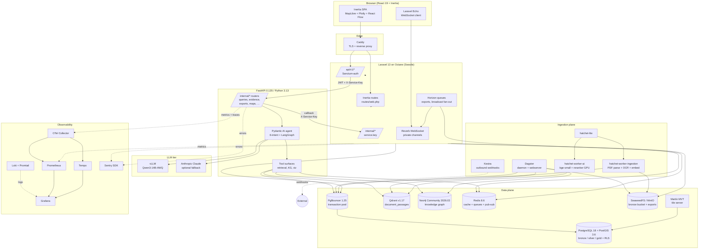

# Solution Architecture Document (SAD) — GeoRAG Intelligence V1.0

> Generated handover documentation. Inferred from the codebase at
> `C:\Users\GeoRAG\Herd\georag\` on 2026-05-28. Where the implementation
> diverges from the architecture spec (`georag-architecture.html`), this
> document records what the code actually does.

---

## 1. System Overview

**GeoRAG Intelligence** is a geological intelligence platform that ingests
decades of fragmented mineral-exploration data (drill logs, NI 43-101 reports,
geophysical surveys, GIS layers, public-geoscience registries) and lets
geologists query it in natural language. Answers are returned with mandatory
citations to source chunks, accompanied by interactive map / drill-hole /
chart visualizations, and can be exported to industry modelling tools
(GeoPackage, Shapefile, Leapfrog-friendly CSV).

### Primary users

- **Field & office geologists** at junior mining and exploration companies
  (the "Field mode" vs "Office mode" toggle is wired into the chat surface
  and pre-processor — see `project_phase3_geologist_question_plan`).
- **Exploration managers / portfolio leads** — Foundry/Portfolio dashboards,
  KPI cards, ingestion-health views, target-recommendation cockpit.
- **Operators / data engineers** — Dagster web-server, Hatchet workflows,
  silver-review queue, audit-log inspector.
- **Compliance / audit reviewers** — Trust Inspector drawer, citation
  feedback, refusal-rate dashboards.

### Business purpose

Turn private exploration archives into a queryable, citation-bound knowledge
base for junior miners that cannot afford an in-house data team. Designed
for **private-cloud or on-premise deployment** — no SaaS dependencies in the
critical path; all third-party deps are MIT / BSD / Apache 2.0 / MPL-2.0.

### Product summary

- Natural-language chat over a corpus that mixes structured drill data,
  unstructured NI 43-101 reports, GIS rasters, and public-geoscience
  registries (SMDI, MINFILE, MRDS, …).
- Citation-first answers — every claim carries a `source_chunk_id`; the
  agent refuses rather than hallucinates (six-layer hallucination prevention
  per architecture-doc §04i).
- Interactive map (MapLibre), drill-hole detail, cross-section panels,
  geochemistry charts, structure rose diagrams.
- Workspace-scoped tenancy with Row-Level Security on silver/gold tables.
- Background ingestion pipeline (Dagster + Hatchet) for bulk uploads;
  Horizon queues for user-triggered jobs.

---

## 2. Architecture Summary

| Layer                   | Technology                                                                                          |
| ----------------------- | --------------------------------------------------------------------------------------------------- |
| Frontend framework      | React 19 + Inertia.js v3 (server-driven SPA), shadcn/ui + Radix UI + Tailwind CSS v4, MapLibre GL, React Flow, Plotly |
| Backend framework       | Laravel 13 on PHP 8.4 / 8.5, served by Laravel Octane (Swoole). Horizon (queues) + Reverb (WebSockets) + Pulse (metrics) + Sanctum (auth). |
| Domain service          | FastAPI 0.135.x on Python 3.13. Pydantic AI for agentic orchestration. asyncpg / redis.asyncio / async Neo4j / async Qdrant — async-native drivers only. |
| Ingestion orchestrator  | Dagster (assets, sensors, jobs) for scheduled / bulk pipelines. Hatchet (lite, plus dedicated ingestion + AI workers) for durable workflows with retries. Kestra wired for outbound webhooks. |
| Primary database        | PostgreSQL 18.3 + PostGIS 3.6.3, fronted by PgBouncer (edoburu 1.25) in transaction-pool mode.       |
| Vector store            | Qdrant v1.17 (canonical-corpus collection: `document_passages`; legacy: `public_geoscience`).        |
| Graph store             | Neo4j Community 2026.03 (no clustering / no enterprise features).                                    |
| Cache / pub-sub         | Redis 8.6.                                                                                          |
| Object storage          | SeaweedFS (S3-compatible) per ADR-0001 — replaces MinIO in target deployments. Compose ships `minio` for current dev (see Missing / Needs Confirmation). |
| Tile serving            | Martin (Mapbox MVT, NOT Mapbox GL — MapLibre GL on the client).                                      |
| LLM runtime             | vLLM serving `Qwen/Qwen3-14B-AWQ` (dev + prod). Anthropic Claude wired as optional fallback. Ollama Modelfiles archived under `docker/_deprecated/ollama/`. |
| Embeddings / reranker   | `BAAI/bge-small-en-v1.5` (SentenceTransformer) + `cross-encoder/ms-marco-MiniLM-L-6-v2` — currently on hatchet-worker-ai GPU. A reranker v1 LoRA fine-tune is in flight (`project_reranker_v1`). |
| Auth                    | Laravel Sanctum (Bearer tokens for `/api/v1/*`, SPA cookie-session for the Inertia frontend). FastAPI-side: shared-secret `X-Service-Key` (FASTAPI_SERVICE_KEY) + Sanctum bearer forwarded via `Authorization`. Service-to-service JWTs minted by `FastApiJwtMinter`. |
| Search infra            | Postgres `pg_trgm` for lexical, Qdrant for dense vectors, SPLADE++ for sparse. Hybrid retrieval inside FastAPI. |
| Workflow / streaming    | Reverb (Laravel WebSocket server) for query.*, project.*, workspace.*, admin.* channels. SSE streaming over the FastAPI → Laravel bridge → Reverb → Echo client chain. |
| Observability           | Prometheus + Grafana + Loki + Promtail + Tempo + OTel Collector. Sentry (FastAPI + Laravel SDK installed in composer, BUT `project_sentry_removed_2026_05_21` notes the package was uninstalled at one point — verify current state). Logfire (Pydantic) gated by `LOGFIRE_ENABLED`. |
| Backups                 | `backup-agent` container + `compose.wal-archiving.yml` overlay for Postgres WAL streaming. |
| Secrets                 | SOPS + age (see `ops/runbooks/secret-management.md`). `.env.production.enc` is the SOPS-encrypted production env. |
| Hosting / deploy target | **On-premise / private cloud** via Docker Compose on a single host per environment. SSH-based CD. K3s reference docs exist in `docs/deployment/` but are not the primary target. |

### Profile-gated compose stack

`docker-compose.yml` ships profiles to keep the dev workstation tractable:

- `dev-light` — PostgreSQL, PgBouncer, Redis, Laravel Octane, Horizon,
  Reverb, FastAPI. The always-on application layer.
- `dev-data` — Neo4j, Qdrant, MinIO.
- `dev-ingest` — Dagster daemon + webserver.
- `dev-monitor` — Prometheus + Grafana (+ Loki, Tempo, OTel collector via
  the exporters compose overlay).
- `dev-llm` — vLLM (or Ollama in archived configs).
- `dev-full` — everything.

### Background workers

| Worker                       | Owner                                | Purpose                                                                                  |
| ---------------------------- | ------------------------------------ | ---------------------------------------------------------------------------------------- |
| `laravel-horizon`            | Laravel queues (Redis-backed)        | User-triggered async work — exports, query dispatch, citation resolution, broadcast fan-out. |
| `laravel-reverb`             | Laravel WebSocket server             | Pushes query.validated / progress / refusal events to the SPA over private channels.     |
| `dagster-daemon` + `dagster-webserver` | Dagster                | Scheduled + sensor-driven bulk ingestion pipelines (bronze → silver → gold + indexes).   |
| `hatchet-lite`               | Hatchet self-hosted single-node      | Durable workflow engine (retry / heartbeat / fan-out).                                   |
| `hatchet-worker-ingestion`   | Hatchet Python worker                | PDF parse, OCR, embed, Neo4j writes — the ingest heavy lifting.                          |
| `hatchet-worker-ai`          | Hatchet Python worker (GPU)          | bge-small embeddings + reranker + SPLADE++. Co-tenants with vLLM on the A4500.           |
| `kestra`                     | Kestra                               | Outbound webhooks per master-plan §1 stack discipline (LangGraph boundary check enforces this in CI). |
| `martin`                     | Mapbox vector-tile server (Rust)     | Serves MVT tiles for the silver-schema MVT functions.                                    |
| `caddy`                      | Caddy                                | TLS termination and reverse proxy (compose-side; see `docker/caddy/` config).            |
| `ofelia`                     | Cron-in-Docker                       | Internal cron scheduling for ad-hoc periodic tasks.                                      |
| `backup-agent`               | Custom                               | Postgres + object-store backups; pairs with `compose.wal-archiving.yml`.                 |

There are also one-shot init / warmup services: `minio-init`, `vllm-warmup`,
`georag-phase-b-extract`.

---

## 3. Component Architecture

### 3.1 Frontend / UI

- **Stack**: React 19 + Inertia.js v3 + TypeScript. Components live in
  `resources/js/Pages/` (server-routed) and `resources/js/components/`.
- **Routing**: Inertia replaces Blade views; server returns
  `Inertia::render('Foundry/Lakehouse', $props)` from Laravel controllers.
- **State**: localStorage-first for chat history with a durable server-side
  upsert via `/api/v1/conversations/*`.
- **Real-time**: `laravel-echo` over `pusher-js` protocol against the
  self-hosted Reverb server. Channels are registered in `routes/channels.php`:
  - `query.{queryId}` — token-by-token RAG streaming + final answer.
  - `project.{projectId}.ingestion` — Hatchet/FastAPI ingestion progress.
  - `workspace.{workspaceId}.activity` — Portfolio / Projects activity.
  - `App.Models.User.{id}` — per-user inbox / refusal notifications.
  - `admin.*` — workflow-runs, cluster-ingest, target-recommendation,
    reports, ml-training, audit-findings, alerts-inbox, ingestion-review,
    reports.{build_id}.
- **Map / viz libraries**: MapLibre GL (NOT Mapbox GL — license-mandated),
  React Flow (`@xyflow/react`), Plotly.
- **Build**: Vite 8 + `@vitejs/plugin-react` + Tailwind v4. `npm run build`
  must be followed by `octane:reload` (Octane caches the Vite manifest
  — see `feedback_octane_vite_reload`).

### 3.2 Application / API (Laravel)

- **Entry**: Laravel Octane on Swoole, host port `8888` (`APP_PORT`).
- **HTTP routes**:
  - `routes/web.php` — Inertia-rendered SPA routes (`/dashboard`,
    `/projects/{slug}/...`, `/foundry/...`, `/public-geoscience/...`,
    `/admin/...`).
  - `routes/api.php` — versioned at `/api/v1/*`. Sanctum-protected except
    `/auth/register`, `/auth/login`, `/auth/spa-login`. Plus the
    `/internal/*` bridge group authed by the `service.key` middleware
    (shared FASTAPI_SERVICE_KEY).
  - `routes/channels.php` — Reverb channel authorization closures.
  - `routes/console.php` — Artisan command registration.
- **Auth**: Sanctum personal-access-tokens + SPA cookie-session.
  Throttling buckets: `auth-login` (5/min keyed by email+IP), `queries`
  (shared across the two-phase store/start handshake).
- **Heavy-lift offloading**: All retrieval, LLM calls, and graph reasoning
  are delegated to FastAPI over HTTP via `App\Services\FastApi*` clients
  with `FastApiJwtMinter`-minted service JWTs and the `X-Service-Key`
  shared secret. Laravel never embeds vectors or talks to Qdrant / Neo4j
  directly.
- **Queues**: Horizon supervises Redis queues for exports, broadcast
  bridging, citation resolution, drill-upload reviews.
- **Models**: `app/Models/` — Eloquent. Workspace tenancy on silver tables
  via `workspace_id` + RLS policies (Postgres-enforced).
- **Octane safety**: Service providers must avoid singletons that
  capture request state (see `CLAUDE.md` Hard Rule 3 + the laravel-boost
  guidelines block). Vite manifest is the well-known cache-invalidation
  trap.

### 3.3 Domain Service / API (FastAPI)

- **Entry**: `src/fastapi/app/main.py`. 4 uvicorn workers per container
  (per `docker/fastapi.Dockerfile`). Host port `8000`.
- **Routers** (`src/fastapi/app/routers/`, all mounted under `/internal`):
  - `queries.py` — submit RAG query + SSE stream the agent answer.
  - `projects.py` — project metadata + collars (used by the agent to
    scope a query).
  - `answer_runs.py` — answer-run inspection + Trust-Summary payload.
  - `evidence.py`, `outlier_assist.py`, `coverage.py`, `completeness.py`
    — agent tool surfaces.
  - `exports.py` — GeoPackage / Shapefile export builders.
  - `pdf.py`, `ocr_render.py`, `re_ocr_trigger.py` — document parse path.
  - `report_builder.py`, `assessment_summary.py` — long-form report
    synthesis.
  - `maps.py`, `visualizations.py` — map / chart compute endpoints.
  - `interpretation.py` — notes / section-lines / target-zones CRUD.
  - `support_agents.py`, `target_recommendation_cockpit.py`,
    `ml_training.py` — Phase H4 operator surfaces.
  - `audit_findings.py`, `citation_feedback.py`, `conflicts.py`,
    `what_changed.py` — review + audit surfaces.
  - `admin_tier1_misc.py`, `admin_tier234.py` — admin tiers from §11.x.
  - `metrics_ingestion_events.py`, `mv_refresh_trigger.py`,
    `integrations_trigger.py`, `shadow_trigger.py`, `phase0_ops.py`,
    `smdi.py` — operator-callable triggers.
- **Lifespan**: connection pools (asyncpg, async Qdrant, async Neo4j,
  redis.asyncio, optional pooled `anthropic.AsyncAnthropic`) and ML
  models (SentenceTransformer + CrossEncoder) are eagerly initialised
  on startup and stored on `app.state`.
- **Agent**: Pydantic AI agent in `app/agent/` + `app/agents/`. Six-intent
  classifier + LangGraph "Agentic Retrieval v2" (`AGENTIC_RETRIEVAL_V2_ENABLED`
  flag). The `_call_tool_safely` dispatcher and a regression test pin
  legacy intent tool signatures.
- **Citations**: every LLM tool-call output is typed with Pydantic;
  outputs without `source_chunk_id` are rejected by the output validator
  (hallucination layer 2).

### 3.4 Ingestion (Dagster + Hatchet)

- **Dagster** (`src/dagster/georag_dagster/`):
  - `assets/` — bronze (raw landed), silver (validated typed), gold
    (analytics-ready) asset definitions. ~40 asset modules covering
    PDF reports, lithology, geophysics, samples, seismic, spatial,
    surveys, well-logs, XLSX, XYZ, public-geoscience, plus index
    builders for `document_passages` (Qdrant) and Neo4j graph projection.
  - `parsers/` — format-specific parsers (LAS, SEGY, SHP/GPKG, NI 43-101
    PDFs via the §04p in-process stack).
  - `checks/` — Dagster asset checks (quality gates).
  - `sensors` via `definitions.py` — bronze-bucket sensors trigger silver
    runs.
  - `dq_writer.py` — writes per-asset DQ results to silver tables.
- **Hatchet workers** — long-running durable workflows for the user-upload
  path (drill-uploads, PDF ingest with retries, heartbeating). Workflow
  modules live in `src/fastapi/app/hatchet_workflows/`.
- **State machine**: silver.reports + silver.ingest_progress track end-to-end
  pipeline status. Stale-run sweep dispatches embed cron every 10 min
  (`project_pipeline_resilience_2026_05_22`).

### 3.5 Database / storage layer

- **PostgreSQL 18 + PostGIS 3.6** — 188 Laravel migrations under
  `database/migrations/`. Raw SQL companion DDL lives in `database/raw/`
  for partitioned tables (`pg_partman`), RLS policies, and MVT
  Mapbox-vector-tile functions (`silver.mvt_*`).
- **Schemas**: `public` (Laravel tables, public.smdi_deposits standalone),
  `bronze` (raw landed: source_files, ingest_manifest, provenance),
  `silver` (validated typed domain), `gold` (analytics + visualization).
- **Roles**: `georag` (owner, used by migrations via `pgsql_migrations`
  connection), `georag_app` (runtime — no DDL), `georag_read` /
  `georag_write` / `georag_audit` (separation; see
  `project_init_roles_gap`), `martin_ro` (tile server read-only).
- **Tenancy / RLS**: `workspace_id` on every silver table; RLS policies
  enforce per-workspace isolation via `SET LOCAL georag.workspace_id`
  applied by `AgentDeps.acquire_scoped` on the FastAPI side
  (`project_rls_coverage_audit_2026_05_25`).
- **Qdrant** — canonical collection `document_passages` (per
  `project_adr_0010_session_a_b_2026_05_28`). Legacy `public_geoscience`
  collection retained for public-geoscience corpus.
- **Neo4j** — knowledge graph: DrillHole, Lithology, Alteration, Sample,
  Structure, Report nodes + relationships per architecture-doc §04e.
- **Redis** — session cache, broadcast pub/sub, Horizon queues,
  rate-limit buckets.
- **SeaweedFS / MinIO** — bronze bucket landing zone for user uploads;
  attachment storage for figures extracted from PDFs.

### 3.6 Auth / session layer

- **SPA login** (`POST /api/v1/auth/spa-login`) — cookie session,
  requires `GET /sanctum/csrf-cookie` first.
- **Token login** (`POST /api/v1/auth/login`) — issues Sanctum personal
  access token; clients pass `Authorization: Bearer <token>`.
- **`auth:sanctum` middleware** on all `/api/v1/*` except the auth
  group itself.
- **Service auth (Laravel ↔ FastAPI)**:
  - Inbound from FastAPI to `/internal/*` — `service.key` middleware
    checks `X-Service-Key == FASTAPI_SERVICE_KEY`.
  - Outbound from Laravel to FastAPI — `FastApiJwtMinter` issues
    short-lived JWTs (kid header rotation supported) plus the same
    `X-Service-Key`.
- **Tenancy** — workspace_id is propagated end-to-end. `MULTI_TENANT_ENFORCEMENT_ENABLED`
  gate in FastAPI; `SINGLE_TENANT_MODE=true` is the dev escape hatch.
  Production must set `MULTI_TENANT_ENFORCEMENT_ENABLED=true` and
  `SINGLE_TENANT_MODE=false`. FastAPI refuses to start if both are
  false.

### 3.7 External integrations

- **Anthropic Claude API** — optional LLM fallback (`LLM_BACKEND=anthropic`),
  pooled `AsyncAnthropic` client on `app.state.anthropic_client`.
- **Public-geoscience registries** — SMDI (Saskatchewan), MINFILE (BC),
  MRDS (US), regional jurisdiction tables; ingested as a parallel
  pipeline (`project_smdi_parallel_pipeline_2026_05_25`).
- **Sentry** — wired into both Laravel and FastAPI. Status flagged as
  needs-confirmation per `project_sentry_removed_2026_05_21`.
- **Logfire / OpenTelemetry** — `LOGFIRE_ENABLED` gate; auto-wires
  `instrument_pydantic_ai`, `instrument_fastapi`, `instrument_asyncpg`,
  `instrument_httpx`.
- **GHCR** — image registry destination for CI (`ghcr.io/<owner>/georag-{fastapi,laravel,dagster}`).

### 3.8 File / media storage

- **Uploads** — Laravel `UploadController` and `DrillUploadController`
  land files in the bronze MinIO/SeaweedFS bucket, then trigger
  Dagster (GraphQL) or Hatchet workflow. Bronze.source_files /
  bronze.ingest_manifest provenance rows are written.
- **PDF extracted figures** — uploaded back to object storage and
  linked via the figure→caption linker introduced
  `project_overnight_run_2026_05_22`.
- **Exports** — Horizon-built GeoPackage / Shapefile / CSV artifacts
  stored in object storage; download via `GET /api/v1/exports/{export}/download`
  redirect to a pre-signed URL.

### 3.9 Notifications / email

- **Real-time** — Reverb WebSocket private channels (in-app).
- **Email** — no SMTP wiring observed in the routes / config inspection.
  Email notifications are **not implemented** as of this inspection.
- **PagerDuty / Slack** — Kestra is wired and `phase_g_followup_kestra_pagerduty_wired`
  references PagerDuty hookup; details live in Kestra flows under
  `kestra/` (not inspected end-to-end here).

### 3.10 Admin tools

- **Foundry/* Inertia pages** — Portfolio, Projects index, Drill review,
  Ingestion runs, Audit log, Retrieval inspector, Support cockpit,
  Decisions, Saved map views, What's-changed, Reasoning, Workspace
  3D, etc. (33+ controllers under `app/Http/Controllers/Foundry/`).
- **Dagster web-server** — direct asset/job inspection at port 3000
  (default).
- **Grafana / Prometheus / Loki** — operational dashboards (port
  3000 / 9090 / 3100; ports overlap so see compose for the real mapping).
- **Hatchet UI** — workflow inspection.
- **Pulse** — Laravel internal app metrics dashboard.

---

## 4. Architecture Diagram

---

## 5. Cross-cutting concerns

- **Hallucination prevention** — six-layer model (retrieval quality gate
  → typed-output validation → numerical claim verification → entity
  resolution → chunk provenance → geological constraint rules). All RAG
  code must respect this; documented in architecture-doc §04i and
  reinforced in `CLAUDE.md` Hard Rule 5.
- **Workspace RLS** — every silver table has RLS; FastAPI uses
  `AgentDeps.acquire_scoped` to open a transaction and `SET LOCAL` both
  `georag.workspace_id` and `statement_timeout`. The
  `WorkspaceRlsCoverageTest` is a regression gate.
- **Octane safety** — singleton + request-state interactions are a
  documented hazard (see Laravel Boost guidelines in `CLAUDE.md`).
- **No GPL** — license policy in `CLAUDE.md` (free + permissive only).
- **No Streamlit / no Mapbox GL / no Neo4j Enterprise** — hard rules.

---

## 6. Missing / Needs Confirmation

- **SeaweedFS vs MinIO** — ADR-0001 selects SeaweedFS, but
  `docker-compose.yml` still defines a `minio` + `minio-init` service.
  Confirm whether SeaweedFS has fully replaced MinIO in the current
  deployment or whether both coexist.
- **Sentry status** — `composer.json` requires `sentry/sentry-laravel`,
  but auto-memory note `project_sentry_removed_2026_05_21` records the
  package was uninstalled and `.env` wiring commented out. The current
  state was not re-verified for this document.
- **Email / SMTP** — no mail driver or notification scaffolding was
  observed during inspection. Assume **no outbound email**.
- **K3s / Kubernetes** — `docs/deployment/k3s-quickstart.md` and
  `kubernetes/` exist but the primary deploy path documented in
  `cd.yml` is SSH + `docker compose`. K3s appears reference-only.
- **vLLM resource limits** — intentionally absent in compose
  (documented in the file header). Confirm production node sizing
  matches `ops/baselines/capacity-planning.md`.
- **Auth methods other than Sanctum** — the architecture HTML may
  describe OIDC / SSO. Code inspection only shows Sanctum.
- **PagerDuty / Slack integration** — `kestra/` flows referenced in
  notes but not inspected as part of this document.
- **Public REST API breadth** — `PublicApiController` exposes
  `/api/v1` index, `openapi.json`, answers, maps, reports, targets,
  interpretations, audit, usage, webhooks. The OpenAPI surface at
  `docs/api/openapi.json` is partial (covers only the FastAPI
  `/internal/*` queries + projects + outlier-assist + exports + a
  few triggers — not the public Laravel surface). See API_DOCUMENTATION.md.

---

## 7. References

- `README.md`, `CLAUDE.md`, `AGENTS.md`
- `georag-architecture.html` — canonical spec
- `docs/RUNBOOK.md`, `docs/OPERATOR-AFTERNOON.md`,
  `docs/acceptance-criteria.md`
- `docs/adr/` — ADR-0001 (SeaweedFS), ADR-0002 (§04p replaces RAGFlow),
  ADR-0005 (TIFF normalise), ADR-0007 (chat cards), ADR-0010 (canonical
  passages corpus)
- `ops/runbooks/` — 28 operational runbooks
