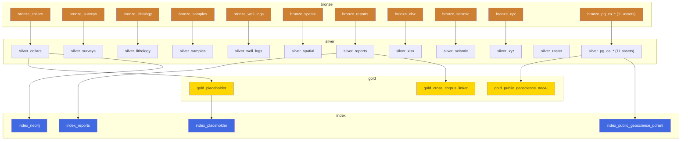

# GeoRAG Ingestion Pipeline — Dagster Asset Graph Inventory
<!-- Produced by: data-engineer agent (Claude Sonnet 4.6) -->
<!-- Date: 2026-04-20 (Module 3 Phase A, subsection A1) -->
<!-- Authority: iterative read of src/dagster/georag_dagster/ source files -->
<!-- Status: read-only audit — no code changes made -->

---

## Asset Inventory

### Bronze Layer (`group_name="bronze"`)

| Asset key | Deps | IO Manager | Required resources | Partitions | Auto-materialize | Compute kind |
|---|---|---|---|---|---|---|
| `bronze_collars` | none | default | `minio` | none | none | — |
| `bronze_surveys` | none | default | `minio` | none | none | — |
| `bronze_lithology` | none | default | `minio` | none | none | — |
| `bronze_samples` | none | default | `minio` | none | none | — |
| `bronze_well_logs` | none | default | `minio` | none | none | — |
| `bronze_spatial` | none | default | `minio` | none | none | — |
| `bronze_reports` | none | default | `minio` | none | none | — |
| `bronze_xlsx` | none | default | `minio` | none | none | — |
| `bronze_seismic` | none | default | `minio` | none | none | — |
| `bronze_xyz` | none | default | `minio` | none | none | — |
| `bronze_pg_ca_sk_mine_loc` | none | default | — | none | none | — |
| `bronze_pg_ca_sk_smdi` | none | default | — | none | none | — |
| `bronze_pg_ca_sk_drillhole` | none | default | — | none | none | — |
| `bronze_pg_ca_sk_resource_potential` | none | default | — | none | none | — |
| `bronze_pg_ca_sk_rock_samples` | none | default | — | none | none | — |
| `bronze_pg_ca_sk_assessment_underground` | none | default | — | none | none | — |
| `bronze_pg_ca_sk_assessment_ground` | none | default | — | none | none | — |
| `bronze_pg_ca_sk_assessment_airborne` | none | default | — | none | none | — |
| `bronze_pg_ca_sk_mineral_disposition` | none | default | — | none | none | — |
| `bronze_pg_ca_sk_bedrock_geology` | none | default | — | none | none | — |
| `bronze_pg_ca_bc_minfile` | none | default | — | none | none | — |

### Silver Layer (`group_name="silver"`)

| Asset key | Deps | IO Manager | Required resources | Partitions | Auto-materialize | Compute kind |
|---|---|---|---|---|---|---|
| `silver_collars` | `bronze_collars` | default | `postgres`, `minio` | none | none | — |
| `silver_surveys` | `bronze_surveys` | default | `postgres`, `minio` | none | none | — |
| `silver_lithology` | `bronze_lithology` | default | `postgres`, `minio` | none | none | — |
| `silver_samples` | `bronze_samples` | default | `postgres`, `minio` | none | none | — |
| `silver_well_logs` | `bronze_well_logs` | default | `postgres`, `minio` | none | none | — |
| `silver_spatial` | `bronze_spatial` | default | `postgres`, `minio` | none | none | — |
| `silver_reports` | `bronze_reports` | default | `postgres`, `minio` | none | none | — |
| `silver_xlsx` | `bronze_xlsx` | default | `postgres`, `minio` | none | none | — |
| `silver_seismic` | `bronze_seismic` | default | `postgres`, `minio` | none | none | — |
| `silver_xyz` | `bronze_xyz` | default | `postgres`, `minio` | none | none | — |
| `silver_raster` | none (independent) | default | `postgres`, `minio` | none | none | — |
| `silver_pg_ca_sk_mine_loc` | `bronze_pg_ca_sk_mine_loc` | default | `postgres` | none | none | — |
| `silver_pg_ca_sk_smdi` | `bronze_pg_ca_sk_smdi` | default | `postgres` | none | none | — |
| `silver_pg_ca_sk_drillhole` | `bronze_pg_ca_sk_drillhole` | default | `postgres` | none | none | — |
| `silver_pg_ca_sk_resource_potential` | `bronze_pg_ca_sk_resource_potential` | default | `postgres` | none | none | — |
| `silver_pg_ca_sk_rock_samples` | `bronze_pg_ca_sk_rock_samples` | default | `postgres` | none | none | — |
| `silver_pg_ca_sk_assessment_underground` | `bronze_pg_ca_sk_assessment_underground` | default | `postgres` | none | none | — |
| `silver_pg_ca_sk_assessment_ground` | `bronze_pg_ca_sk_assessment_ground` | default | `postgres` | none | none | — |
| `silver_pg_ca_sk_assessment_airborne` | `bronze_pg_ca_sk_assessment_airborne` | default | `postgres` | none | none | — |
| `silver_pg_ca_sk_mineral_disposition` | `bronze_pg_ca_sk_mineral_disposition` | default | `postgres` | none | none | — |
| `silver_pg_ca_sk_bedrock_geology` | `bronze_pg_ca_sk_bedrock_geology` | default | `postgres` | none | none | — |
| `silver_pg_ca_bc_minfile` | `bronze_pg_ca_bc_minfile` | default | `postgres` | none | none | — |

### Gold Layer (`group_name="gold"`)

| Asset key | Deps | IO Manager | Required resources | Partitions | Auto-materialize | Compute kind |
|---|---|---|---|---|---|---|
| `gold_placeholder` | `silver_collars` | default | none | none | none | — |
| `gold_public_geoscience_neo4j` | multiple silver_pg_* | default | `neo4j`, `postgres` | none | none | — |
| `gold_cross_corpus_linker` | `silver_reports` (implied) | default | `postgres`, `neo4j` | none | none | — |

### Index Layer (`group_name="index"`)

| Asset key | Deps | IO Manager | Required resources | Partitions | Auto-materialize | Compute kind |
|---|---|---|---|---|---|---|
| `index_placeholder` | `gold_placeholder` | default | none | none | none | — |
| `index_neo4j` | `silver_collars` (implied) | default | `neo4j`, `postgres` | none | none | — |
| `index_reports` | `silver_reports` | default | `qdrant`, `postgres`, `minio` | none | none | — |
| `index_public_geoscience_qdrant` | multiple silver_pg_* | default | `qdrant`, `postgres` | none | none | — |

---

## Asset Check Registrations

**Zero `AssetCheckSpec` definitions found anywhere in the codebase.**

No `@asset_check` decorators, no `AssetCheckSpec` instantiations, and no `checks=` parameters on any `@asset` definition are present in `src/dagster/georag_dagster/`. The Dagster UI has no registered asset checks; no blocking gates exist between Bronze and Silver or Silver and Gold.

---

## Sensors

| Name | Trigger | Watch target | Min interval | Blocking |
|---|---|---|---|---|
| `minio_upload_sensor` | Poll | `bronze` bucket, `recursive=True` object listing | 300 s (5 min) | No |

Notes:
- The sensor still names itself `georag-bronze` in its docstring comment (line 349 of `definitions.py`) but correctly uses bucket name `"bronze"` in its runtime code (line 371). The docstring drift is a cosmetic issue only; the live code is correct post-Module-2 rename.
- The sensor uses `client.list_objects` and `client.bucket_exists` from the `minio` SDK (vendor-specific), not boto3 — pre-approved for refactor in Module 3 Phase B (see `ops/backlog/module-3-intake.md`).
- The sensor uses a timestamp cursor (last_modified comparison) not a SHA-256 seen-set. A file overwritten with different content but the same modification time would be missed.

---

## Schedules

| Name | Cron | Target | Default status |
|---|---|---|---|
| `full_ingest_schedule` | `0 2 * * *` (daily 02:00 UTC) | `AssetSelection.all()` | STOPPED |
| `public_geoscience_weekly_refresh` | `0 3 * * 0` (Sundays 03:00 UTC) | `_PG_ACTIVE_ASSETS` (11 SK + BC pairs + Gold + Index) | STOPPED |
| `public_geoscience_daily_edit_check` | `30 5 * * *` (daily 05:30 UTC) | `_PG_ACTIVE_ASSETS` with `skip_if_unchanged=True` | STOPPED |

All three schedules are STOPPED by default (must be manually enabled via Dagster UI). This is correct for a dev-first posture but needs documentation for production enablement runbook.

---

## Resource Registry

| Resource key | Class | Backend | Notes |
|---|---|---|---|
| `postgres` | `PostgresResource` | psycopg2 via pgbouncer:6432 | Sync (correct for Dagster) |
| `minio` | `MinIOResource` | `minio-py` SDK | **Vendor SDK — pre-approved boto3 refactor (Phase B)** |
| `qdrant` | `QdrantResource` | qdrant-client | Sync client, host=`qdrant`:6333 |
| `neo4j` | `Neo4jResource` | neo4j sync driver | auth_enabled=True in production defs; pool=50 |

---

## Dependency Graph (Mermaid)

**Notable gaps visible in graph:**
- `silver_raster` has no Bronze dependency declared (orphan asset — no bronze_raster asset exists)
- `silver_surveys`, `silver_lithology`, `silver_samples`, `silver_well_logs`, `silver_spatial`, `silver_xlsx`, `silver_seismic`, `silver_xyz` all feed no Gold or Index asset — their data stops at Silver with no downstream path
- `index_neo4j` has an implied dep on `silver_collars` but the graph does not show a pathway through these silvers to any index asset
- No `silver_drill_traces` asset exists in the graph at all (desurvey pipeline is absent)

---

*Audit date: 2026-04-20. Read-only pass. No code or config modified.*

---

## Post-audit additions — UPDATE 2026-04-21

This document is the frozen Phase A snapshot. Several assets + checks have been
added during Phase B. Current state as of 2026-04-21:

- **54 assets** (was 53) — added `commit_ingestion_run` as the terminal data_version-bump gate (Module 3 Chunk 1)
- **26 blocking asset checks** (was 0) — added across Chunk 1, Chunk 2, and the minor-observations closeout
- **`silver_drill_traces`** — added in Chunk 2 (desurvey pipeline via `wellpathpy.minimum_curvature`). The "desurvey pipeline is absent" note above is OBSOLETE as of 2026-04-20 Chunk 2.
- **`silver_cog_rasters` + `bronze_raster_uploads` (stub)** — added in Chunk 2 (COG normalization via `rio_cogeo`). `silver_raster` is no longer an orphan — the COG pipeline wires it.
- **`silver_seismic` + `silver_xyz`** — still graph dead-ends by design, but now protected with blocking asset checks (`parse_total_positive`, `schema_conformance_pass_rate`). Silver-trapped retrieval wiring logged to `ops/backlog/module-4-intake.md` + `ops/backlog/module-8-intake.md`.

Full Chunk-by-Chunk detail + asset-check inventory is in
`ops/audit/2026-04-20-ingestion-audit.md` ("Chunk 1", "Chunk 2", "Chunk 3a",
"Chunk 2 cleanup" sections).

This Phase A snapshot is preserved unchanged above as the historical record.
